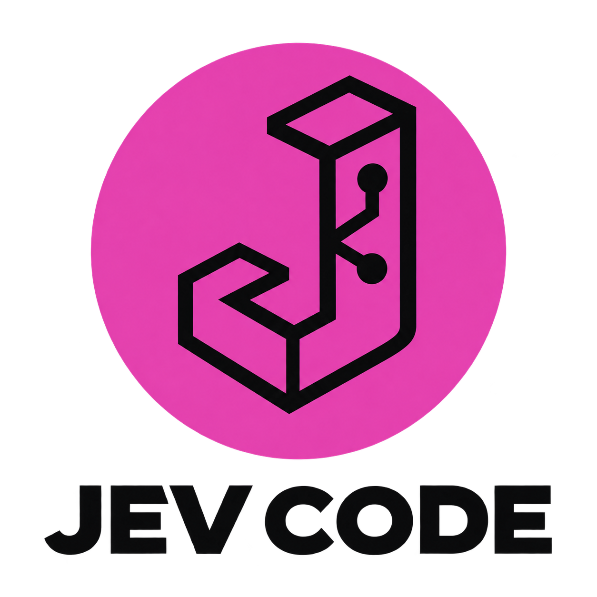

<p align="center">
  
</p>

[Install](https://raw.githubusercontent.com/rhighs/jev-code/main/install.sh) · macOS / Linux

```bash
curl -fsSL https://raw.githubusercontent.com/rhighs/jev-code/main/install.sh | bash
export PATH="$HOME/.local/bin:$PATH"
```

An interactive coding CLI powered by [Jev](https://typesafe.ai). Watch source take shape, run tools, send updates, and see elapsed time after every turn.

```bash
export TYPESAFE_API_KEY="your-typesafe-key"
jev-code
```

| Language | Support |
| --- | --- |
| Python | Built-in AST generation; needs Python 3.9+. Bounded grammar. |
| Bash | Built-in command ASTs: arguments, pipes, redirects, conditions, sequences. |
| TypeScript | `jev-code ast install builtin:typescript` — starter AST grammar. |
| Other languages | Install an AST adapter; general files use bounded text choices. |

Try: `write a for loop in Python and run it`.

`/help` · `/status` · `/files` · `/show main.py` · `/cancel` · `/permissions auto` · `/exit`

Experimental: complex tasks can still fail. Bash executes on your machine and asks permission by default. The installer reuses Node.js 22+ or installs a private Node.js 24 runtime; rerun it to update.

[AST adapters, options, logs, development, and tested limits →](docs/guide.md)
