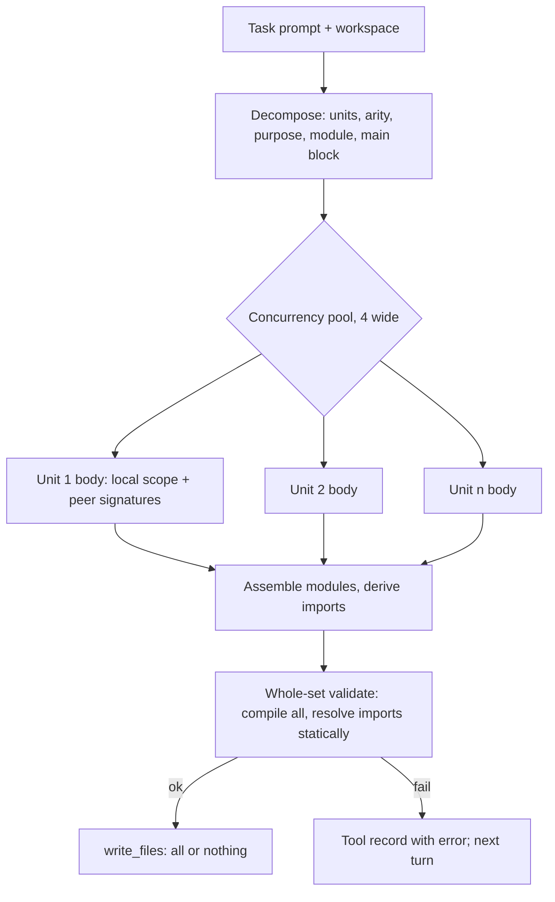
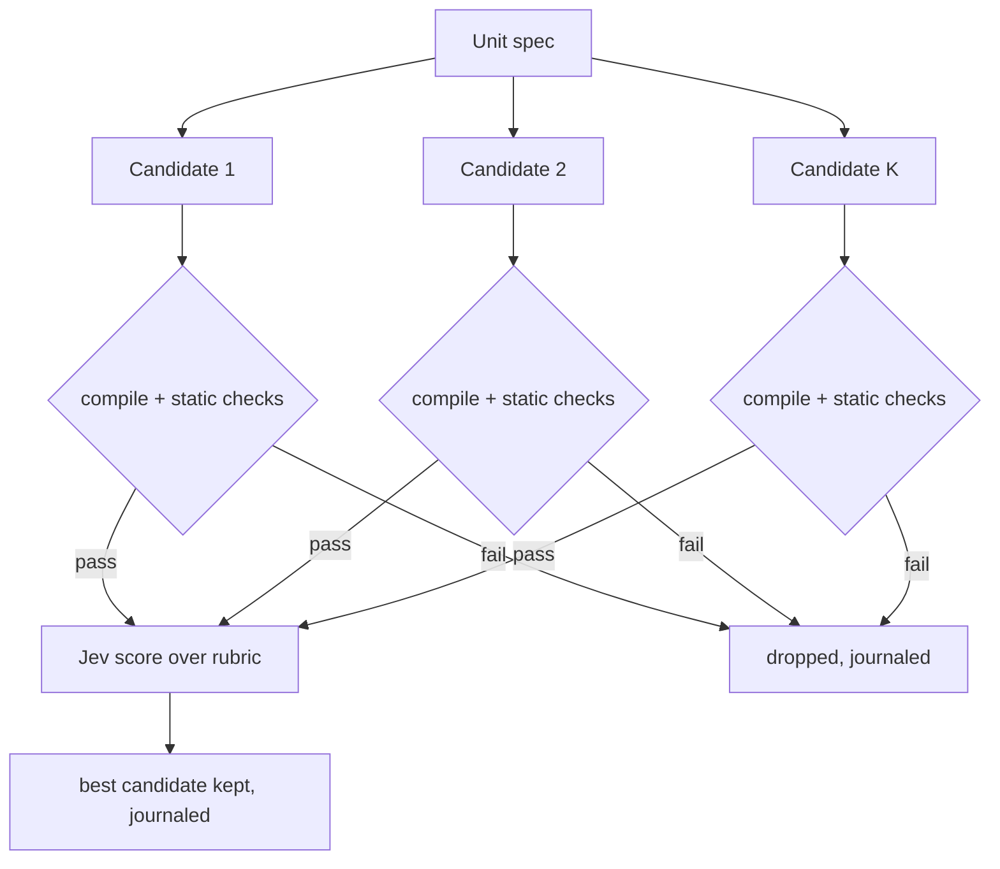

# Generation Power - Plan

## Goal Capsule

- **Objective:** Make Jev produce longer, correct Python programs end to end, measured by a live eval ladder: number-guessing game, multi-function script with file I/O, multi-file package.
- **Product authority:** Roberto Montalti (sole maintainer). Product decisions were confirmed in dialogue on 2026-09-18; the Product Contract below is authoritative over this plan's implementation sections.
- **Authority hierarchy:** Product Contract, then Planning Contract, then Implementation Units. Repo conventions in the root instructions override unit approach notes where they conflict.
- **Execution profile:** Three stages landed in order: A (eval + decision sight), C (decompose and fill, multi-file), B (search). Each stage ends with an eval comparison before the next begins.
- **Stop conditions:** Stop and surface if a stage's eval comparison shows a regression on an earlier task, if the Jev request contract turns out to differ from the documented one, or if a unit needs a product-scope change.
- **Tail ownership:** The implementer owns typecheck, tests, and the eval comparison per stage. The maintainer runs the live eval and decides when a stage is accepted.
- **Product Contract preservation:** changed: R9 moved from the stage A group to the stage C group (KTD5 lands the outline with decomposition); Outstanding Questions — removed the R9/R10 outline question, resolved by KTD5. Requirement text and IDs unchanged.
- **Open blockers:** None.

---

## Product Contract

### Summary

Add a repeatable live eval suite, then improve generation in three stages: give Jev a rendered view of the program at each decision, generate programs as a decomposition into independent units filled in parallel, and add beam search with pruning over those units.

### Problem Frame

Jev generates code as a sequence of constrained AST choices. That works for one-liners: hello world takes 3 turns and about 16 requests. It fails on the first real program. A number-guessing-game trial exhausted 256 productions without writing a file.

The grammar is not the blocker. The current Python subset already covers everything the guessing game needs. The failures come from how each decision is made:

- Jev sees the partial program as raw AST JSON, never as source text. It also sees only the last two tool records.
- Every production is one sequential request. A 40-line program is hundreds of dependent round trips, each shipping the whole partial tree.
- One bad pick is final. There is no backtracking and no alternative branch.
- Each file is generated from an empty scope. Nothing carries symbols or imports between files.

There is also no way to measure progress. Tests use a scripted provider and never touch live Jev, so a change to decision context cannot be shown to help or hurt.

### Key Decisions

- **Measure before changing.** A live eval suite ships first and gates every later stage. Without it, generation changes are guesses.
- **Correct beats idiomatic.** A program passes when it runs and its checker passes. Nested if/else instead of elif, no f-strings, no try/except. Grammar growth is a separate track.
- **Decompose, then fill.** Jev first chooses a decomposition (units, names, arities, one-line purposes, and for multi-file which module holds which unit). Each unit body is then generated with only local context. This is the mechanism that makes the 32k context limit stop mattering and gives multi-file support for free.
- **Jev picks the file layout.** For multi-file tasks the prompt describes the shape ("a package with a module and a script") and Jev chooses paths and the split. Eval prompts therefore must not name files.
- **Search comes last and sits on units.** Beam search over whole programs is expensive and weakly guided. Over small independent units it is cheap and can be pruned per unit by compile, quick run, and Jev's own score.
- **No hard budget during development.** Correctness first. Cost tuning is a later concern. Eval runs against live Jev cost real money per run and that is accepted.

### Requirements

**Eval suite**

- R1. The repo ships a runnable eval command that executes a fixed set of tasks against live Jev and reports pass or fail, request count, elapsed time, and token usage per task.
- R2. The suite contains at least the three ladder tasks: number-guessing game, multi-function script with file I/O, multi-file package.
- R3. Each task carries its own deterministic checker that seeds randomness and drives stdin where needed, so pass or fail never depends on chance or a human.
- R4. Each task can override run limits (turns, requests, generation steps, run time) so "no hard budget" is expressible per task.
- R5. Eval results are persisted per run in a form that lets two runs be compared, including which stage of generation was active.
- R6. Multi-file task prompts describe the required shape without naming files.

**Decision sight (stage A)**

- R7. Every AST decision presents Jev with the rendered source so far, with a visible marker at the slot being filled, in addition to or instead of raw AST JSON.
- R8. Decision context stays within Jev's request budget for programs at least as large as the file I/O ladder task, with a documented policy for what is dropped first when it does not fit.

**Decompose and fill (stage C)**

- R9. Before filling statements, Jev chooses an outline of the program so later decisions are conditioned on an intent, not only on the partial tree.
- R10. Jev chooses a decomposition of the task into units before generating any body: unit names, arities, one-line purposes, and for multi-file tasks the module that holds each unit.
- R11. Each unit body is generated independently with only its local context plus the signatures of the other units, and independent units generate concurrently.
- R12. Assembled output is validated as a whole (compiles, imports resolve across files) before any file is written.
- R13. Cross-file references are consistent: a unit that calls another unit in a different module has the matching import in its file.

**Search (stage B)**

- R14. Generation can keep up to K alternative candidates for a unit, where K is configurable and K=1 reproduces stage C behavior exactly.
- R15. Candidates are pruned by objective signals first (compile, syntax, quick execution where safe) and by Jev's own score second.
- R16. Search events are visible in the run journal and terminal so a user can see branches being kept and dropped.

### Key Flows

- F1. Eval run
  - **Trigger:** Maintainer runs the eval command, optionally for one task.
  - **Steps:** For each task, start a fresh workspace; run the harness with the task prompt and its limits; run the task checker on the resulting workspace; record outcome, requests, time, tokens, and active stage.
  - **Outcome:** A per-run report and a persisted record comparable to previous runs.
  - **Covers R1, R2, R3, R4, R5.**

- F2. Decompose-and-fill generation of one file set
  - **Trigger:** Harness chooses a write action for a Python task.
  - **Steps:** Jev picks an outline and a decomposition; each unit body is generated concurrently with local context and peer signatures; units are assembled into files; whole-set validation runs; files are written only if validation passes.
  - **Outcome:** One or more files written atomically, or a failed record with the validation error fed back to the next turn.
  - **Covers R9, R10, R11, R12, R13.**

- F3. Search over a unit
  - **Trigger:** Stage B enabled with K greater than 1.
  - **Steps:** For a unit, up to K candidates are generated; each is checked by objective signals; survivors are scored by Jev; the best survivor is kept; the choice is journaled.
  - **Outcome:** One unit body selected, with dropped candidates visible in the log.
  - **Covers R14, R15, R16.**

### Acceptance Examples

- AE1. Guessing game passes
  - **Covers R2, R3.**
  - **Given** the guessing-game task with a checker that seeds the random module and scripts three guesses.
  - **When** the eval runs.
  - **Then** the generated program reads guesses from stdin, compares against the seeded target, prints higher/lower feedback, and exits after the correct guess; the checker reports pass.

- AE2. Multi-file layout is Jev's
  - **Covers R6, R10, R13.**
  - **Given** a prompt asking for a package with a helper module and a script that uses it, naming no files.
  - **When** generation completes.
  - **Then** at least two Python files exist, the script imports the helper module by the path Jev chose, and running the script succeeds.

- AE3. Context overflow is handled, not fatal
  - **Covers R8.**
  - **Given** a partial program whose full rendered source plus context would exceed the request budget.
  - **When** the next decision is prepared.
  - **Then** lower-priority context is dropped according to the documented policy and the decision proceeds; the run does not stop with a size error.

- AE4. K=1 is a no-op
  - **Covers R14.**
  - **Given** stage B enabled with K=1 and a fixed scripted provider.
  - **When** a unit is generated.
  - **Then** the request sequence and output are identical to stage C with search disabled.

- AE5. Validation failure never writes
  - **Covers R12.**
  - **Given** an assembled multi-file set where one import cannot resolve.
  - **When** whole-set validation runs.
  - **Then** no file is written and the failure text appears in the next turn's tool record.

### Success Criteria

- The guessing-game task passes in at least 3 of 5 consecutive eval runs after stage A, before any decomposition work.
- The file I/O task passes in at least 3 of 5 runs after stage C.
- The multi-file task passes at least once after stage C and in at least 3 of 5 runs after stage B.
- Every stage lands with an eval comparison showing pass rate, requests, and time before and after.
- Existing scripted tests keep passing; typecheck stays clean.

### Scope Boundaries

- The premium terminal experience (formatting, completions, layout parity with Pi and Codex) is a separate brainstorm.
- Grammar growth toward idiomatic Python (elif, f-strings, try/except, keyword arguments, comprehensions, classes) is deferred.
- Other language adapters are untouched. The TypeScript starter adapter and Bash AST are not part of this track.
- Cost and latency optimization is deferred until correctness holds.
- Automatic resume of interrupted runs remains out of scope.

### Dependencies / Assumptions

- Live Jev access with a funded API key is available for eval runs. Eval runs are not part of CI.
- The Jev request payload limit and 32k context stay as they are for the horizon of this work.
- Jev's choice probabilities and noul scores are informative enough to act as a secondary pruning signal. If they prove flat, stage B leans entirely on objective signals.
- Python 3.9+ remains the trusted serializer and validator for generated source.

### Outstanding Questions

**Deferred to Planning**

- How the checker for each eval task is expressed (script per task, shared runner protocol, expected-output fixtures).
- What "quick execution where safe" means for pruning: which units may run, with what timeout and sandboxing.
- How unit signatures are shared into peer contexts without reintroducing the full-tree payload problem.
- Whether the eval report lives as a new subcommand of the CLI or a standalone script.

### Sources

- `docs/guide.md` documents the tested limits and the failed guessing-game trial.
- `src/python-ast.ts` holds the grammar, symbol table, and the per-decision state sent to Jev.
- `src/harness.ts` holds the turn loop, default limits, and context trimming.
- `src/scored-grid.ts` holds the request byte cap and the context compaction used by all generators.
- `src/generation.ts` holds the only existing parallelism (across tool argument fields).
- `test/helpers.ts` holds the scripted provider that all current tests use.

---

## Planning Contract

### Key Technical Decisions

- **KTD1. The eval suite is a CLI subcommand with tasks as directories.** `jev-code eval [task]` mirrors the existing `ast` subcommand dispatch in `src/cli.ts`. Each task lives in `eval/<task>/` with a `task.json` (prompt, limit overrides, stage tag) and a `check.ts` exporting one async function that receives the workspace path and returns pass or fail with a reason. Results append to `.jev/eval/<timestamp>.json`. Rationale: reuses the flag and limit plumbing that already exists, keeps checkers in TypeScript where `node:child_process` can drive a Python process's stdin, and keeps them testable with `node:test` against handwritten reference programs. A standalone script would duplicate `harnessOptions` construction.

- **KTD2. The guessing-game checker plays adaptively.** The checker spawns the program, reads its feedback lines, and binary-searches the target within the prompt's stated range, failing after a bounded number of guesses or on any line it cannot classify. Rationale: the program runs in a separate Python process, so the checker cannot seed its `random` module without changing the prompt. An adaptive driver accepts any correct implementation and satisfies AE1's intent (deterministic pass or fail) without a seed. Fallback if feedback wording proves too free: wrap execution with a launcher that seeds `random` before running the file via `runpy`.

- **KTD3. Rendered source replaces the raw partial AST in decision state.** Each `pick()` sends `partialSource` produced by `previewTree` plus `unparsePython` and drops `partialAst`. Expression holes already render as `__jev_pending__`; `previewTree` must also render a body-position hole as an `Expr(Name('__jev_pending__'))` statement, keeping `pass` only for an empty body, and `block()` must push the statement hole before calling `pick()` and pop it on `finish`, so statement and identifier slots show the marker too. The TypeScript adapter already does this (`src/typescript-ast.ts` sends `partialSource: render()`), so the pattern exists in the repo. Rationale: Jev's documented guidance is to send only context relevant to the current question; source text is far denser than AST JSON and is what the task prompt is written against. The preview subprocess call per step already runs for the terminal, so the cost is unchanged.

- **KTD4. Context budget policy is ordered and enforced in one place.** A single function builds the decision state from prioritized parts and trims from the bottom until the serialized request fits the 24,000-byte cap: task prompt and updates; current slot, symbols, constraints, peer signatures; rendered source windowed around the pending marker; the last two tool records; plan. Rationale: R8 needs one documented policy, AE3 needs overflow to degrade instead of throwing, and three generators currently duplicate the size check.

- **KTD5. Outline and decomposition are one decision phase.** R9's outline is realized by R10's decomposition: Jev picks a list of units (function name, arity, one-line purpose, module) plus a main block, for single-file and multi-file alike. Rationale: a separate stage A outline would be replaced one stage later. The decomposition is the outline. Stage A therefore ships eval, rendered view, and context policy; the outline lands with stage C.

- **KTD6. Units generate concurrently through forked `Decisions`, four wide.** Each unit body runs `block()` in its own scope whose parent scope holds every peer and the unit itself as `{ kind: 'function', arity }`, so peers appear as callees and the existing arity check applies. A flat peer-signature list (`name`, `arity`, `module`, `purpose`) also travels in state as presentation. Units assigned to the entry module are not offered as peers to package-module units. Concurrency is capped at four in-flight requests per run because Jev's cookbooks report rate limiting at eight on a shared key. One failing unit aborts the set, matching the `Promise.allSettled` plus abort pattern in `generateArguments`. Rationale: `Decisions.fork` shares the request counter and abort signal, so budgets and cancellation already work across concurrent forks; a flat signature list keeps per-unit payloads small.

- **KTD7. Multi-file output goes through one new tool that writes a validated set atomically.** A `write_files` tool (effect `write`) has a single string field `files` holding a JSON manifest of path to content. The generator for that field routes to the Python adapter's decompose-and-fill pipeline. The assembler emits the main block inside an `if __name__ == "__main__":` guard, an assembled node like KTD8's derived imports, so every module is importable without side effects. The tool validates without executing anything: the bridge compiles every file and resolves every `Import` and `ImportFrom` target with `importlib.util.find_spec` against a `sys.path` that starts with the temp copy. Before any copy, every manifest key is resolved through the workspace path policy and package and module names are restricted to Python identifiers. Then it writes all files or none. `write_file` stays for single files and reuses the same pipeline with a one-module decomposition. Rationale: the harness executes one tool per turn and `write_file` writes one path, so sequential single-file turns cannot satisfy AE5. A manifest in a string field avoids widening the `Field` type system for one tool.

- **KTD8. Cross-file imports are derived, not chosen.** When a unit in module A calls a unit assigned to module B, the assembler inserts `from B import name` as the first statement of the calling unit's body, so mutual cross-module calls resolve at call time instead of failing on a partially initialised module. Main-block imports are module level, inside the guard. Jev never picks import statements for peer units. Rationale: R13 becomes a property of assembly rather than a decision Jev can get wrong; the module layout is still Jev's.

- **KTD9. Search is a wrapper around unit generation, keyed by width K.** With `--search-width K`, each unit produces up to K candidates from independent forks; candidates that fail the objective pass are dropped; survivors are ranked by a Jev `score` question over a fixed rubric and the top one is kept. K=1 skips the wrapper entirely so request sequences are identical to stage C. The objective pass is compile plus static analysis of the candidate's assembled module: undefined names, calls to peers with the wrong arity, and a missing `return` where the unit's purpose implies a value. No generated code is executed during generation; importing a function-only module would define functions without running them and add nothing beyond compile, and running it would need a sandbox decision this track does not make. Rationale: the SDK exposes a `score` primitive returning a distribution over ordered levels, which is a better ranking signal than comparing `choice` confidences across separate requests. Whole-program search would multiply cost by K at every decision; unit-level search multiplies only the unit's own cost. The repo invariant that the harness compiles generated Python and never executes it itself stays true.

- **KTD10. Search events reuse the text event channel.** `TextProgress.decoder` gains a `search` value and the `ast` payload carries `unit`, `candidate`, and `kept` fields. During concurrent unit generation the pool, not each fork, emits one `text` event per step with the assembled module re-rendered and `ast.unit` set, so the draft pane and journal never interleave unrelated bodies. Rationale: the terminal, JSON output, and journal already route `text` events; a new event type would need three new consumers.

- **KTD11. Tests get a slot-keyed scripted provider.** A new provider answers by `state.generation.slot` and criteria content rather than by turn, records every request, and tolerates any arrival order. Rationale: the existing `ScriptedProvider` scripts one step per turn, which breaks once a turn issues many concurrent requests in nondeterministic order.

### High-Level Technical Design

Decompose-and-fill for one write action. Directional; the prose and units are authoritative.



Unit search with width K, wrapped around one unit body in the pool above.



Decision state composition (KTD4), in trim order from most to least protected:

```text
task prompt + updates
slot, symbols, constraints, peer signatures
rendered source, windowed around __jev_pending__
last two tool records
plan
```

### Assumptions

- Jev's `choice`, `noul`, and `score` contracts match the current docs: one request shares a 32k-token budget between state and questions, `max_tokens_exceeded` is a 400 error type, `score` takes an ordered criteria array (SDK 0.6 breaking change).
- Rate limits are soft and undocumented in detail; four in-flight requests is a safe default and is a flag, not a constant.
- The adaptive guessing-game checker can classify feedback by matching "higher", "lower", "too high", "too low", "correct", or "got it" case-insensitively. Task prompts state the range and ask for those words. Programs are spawned with `python3 -u` so feedback flushes between guesses.
- The maintainer supplies the API key for eval runs; CI never runs the live eval.

### Sequencing

Stage A: U1, U2. Eval baseline recorded before U2 lands, and again after.
Stage C: U3, U4, U5. Eval comparison after U5.
Stage B: U6, U7. Eval comparison after U6; U7 documents all three.

U1 and U2 are independent. U3 precedes U4 because U4's tests need it. U5 depends on U4. U6 depends on U3, U4, and U5. U7 depends on everything.

---

## Implementation Units

### U1. Eval runner and ladder tasks

- **Goal:** A `jev-code eval [task]` subcommand that runs each task in a fresh temp workspace against live Jev, runs its checker, and appends a comparable record.
- **Requirements:** R1, R2, R3, R4, R5, R6. Realizes F1. Enforces AE1.
- **Dependencies:** None.
- **Files:** `src/eval.ts` (create), `src/cli.ts` (modify: subcommand, `--eval-out`, help text), `eval/guessing-game/task.json` and `check.ts` (create), `eval/file-io-script/task.json` and `check.ts` (create), `eval/multi-file-package/task.json` and `check.ts` (create), `test/eval.test.ts` (create), `docs/guide.md` (modify: eval section).
- **Approach:** Task loader reads `task.json` (prompt, `limits`, `stage`), builds `HarnessOptions` the same way the CLI does, with `--yes` semantics so Bash runs unattended. Each run gets `mkdtemp` workspace and journal directory. After the run, the checker receives the workspace path and returns `{ ok, reason }`. Record fields: task, stage, status, checker result, turns, requests, input tokens, duration, run id, git commit. Guessing-game checker per KTD2. File I/O checker runs the script and asserts the output file content the prompt asked for. Multi-file checker asserts two or more `.py` files, runs `main.py` at the workspace root as the entry script, fails with reason `no main.py` when absent, and asserts output. Checkers spawn generated programs through one shared helper that copies `process.env`, deletes `TYPESAFE_API_KEY`, sets cwd to the workspace, pipes stdin, runs `python3 -u`, and applies the task run-time limit as a SIGKILL timeout, mirroring `runBash`. Prompts follow R6: shape words, no file names. Task prompts must state the numeric range and the feedback words for the guessing game.
- **Execution note:** Prove the checkers first against handwritten reference programs, including a deliberately wrong one, before wiring the live runner.
- **Patterns to follow:** `src/cli.ts` `ast` subcommand dispatch and `limit()` validator; `src/harness.ts` journal handling; `Buffer.byteLength` sizing.
- **Test scenarios:**
  - Guessing-game checker passes a correct reference program that prints "Too high" / "Too low" / "Correct".
  - Guessing-game checker fails a program that never prints a recognizable line, within the guess bound, with a reason naming the unrecognized line.
  - Guessing-game checker fails a program that exits before the correct guess.
  - File I/O checker passes when the expected file exists with the expected content, fails when absent or wrong.
  - Multi-file checker fails when only one `.py` file exists; passes with two files and correct entry output.
  - Task loader rejects a `task.json` whose limits are not positive integers.
  - Runner with a `ScriptedProvider` and a trivial task writes a record with all required fields and the `stage` tag.
  - `jev-code eval unknown-task` exits nonzero with a one-line usage error.
  - A checker-spawned program does not see `TYPESAFE_API_KEY` in its environment.
- **Verification:** `npm test` green; `npm run dev -- eval guessing-game` with a live key produces a record in `.jev/eval/` and prints pass or fail with requests and duration.

### U2. Rendered decision context and budget policy

- **Goal:** Every Python AST decision sends rendered source with a pending marker instead of raw AST JSON, built by one prioritized context builder that trims to the request cap.
- **Requirements:** R7, R8. Enforces AE3.
- **Dependencies:** None (U1 baseline should be recorded before this lands).
- **Files:** `src/python-ast.ts` (modify: `pick()` state), `src/decision-context.ts` (create: prioritized builder and trim), `src/scored-grid.ts` (modify: `compactContext` callers or move `MAX_GRID_REQUEST_BYTES`), `test/python-ast.test.ts` (modify), `test/decision-context.test.ts` (create).
- **Approach:** Per KTD3 and KTD4. `pick()` renders the preview once per step and reuses it for both the state and the `onText` callback. The builder takes an ordered list of named parts and a measure function, drops or windows parts from the tail until the request fits, and reports what it dropped so the journal `decision` event can carry `trimmed: [...]`. Source windowing keeps the lines around `__jev_pending__` plus the module header. Remove the 16,000-byte partial-AST throw; the tree still exists for assembly but no longer travels.
- **Patterns to follow:** `src/typescript-ast.ts` `partialSource`; `previewTree` and `unparsePython` in `src/python-ast.ts`.
- **Test scenarios:**
  - A `pick()` state contains `partialSource` with `__jev_pending__` at the slot and no `partialAst` key, for an expression slot and for a statement slot.
  - Builder with parts that fit returns all parts unchanged and an empty trimmed list.
  - Builder over the cap drops `plan` first, then recent records, then windows source, never the prompt or slot.
  - A synthetic 60-line partial program produces a decision request under 24,000 bytes and generation continues instead of throwing.
  - Existing production-order tests in `test/python-ast.test.ts` still pass with the new state shape.
- **Verification:** `npm test` and `npm run typecheck` green; live guessing-game eval run recorded before and after with requests and pass or fail compared.

### U3. Slot-keyed scripted provider for concurrent tests

- **Goal:** A test provider that answers by generation slot and criteria, independent of request arrival order, and records every request.
- **Requirements:** Supports testing of R11, R14, AE4.
- **Dependencies:** None. Precedes U4.
- **Files:** `test/helpers.ts` (modify: add `SlotProvider`), `test/helpers.test.ts` (create).
- **Approach:** Script entries match on `state.generation.phase`, `slot`, and optional unit name; answer by production key or by value label found in criteria; unmatched requests throw with the slot name so tests fail loudly. Support `score` answers. Keep `ScriptedProvider` untouched for existing tests.
- **Patterns to follow:** `AstProvider` in `test/python-ast.test.ts`; `ScriptedProvider` state recording.
- **Test scenarios:**
  - Two requests for different slots answered correctly regardless of order.
  - Unmatched slot throws with the slot in the message.
  - A `score` question returns a full distribution over levels with `score` set to the scripted level.
- **Verification:** `npm test` green.

### U4. Decompose-and-fill for single files

- **Goal:** Python generation starts with a decomposition decision, generates unit bodies concurrently with peer signatures, and assembles one module; `write_file` for `.py` uses this path.
- **Requirements:** R9, R10, R11. Realizes F2 for one module.
- **Dependencies:** U2, U3.
- **Files:** `src/python-units.ts` (create: decomposition, pool, assembly), `src/python-ast.ts` (modify: expose `block()`-level generation for a unit scope; accept peer signatures in state), `src/decisions.ts` (modify: in-flight cap on forks), `src/harness.ts` and `src/cli.ts` (modify: generalize `--grid-concurrency` to `--concurrency`, read by the Decisions in-flight cap and the grid pool), `src/grid.ts` (modify: `ast.unit`), `test/python-units.test.ts` (create), `test/terminal.test.ts` (modify), `docs/guide.md` (modify).
- **Approach:** Per KTD5, KTD6. Decomposition is a short sequence of picks: unit count (0 to 6), then per unit a name from identifier candidates, arity, a purpose chosen from task-derived phrases, and for single files module is fixed. A main block is always present. Each unit body runs in a fresh scope whose parent holds all peers and the unit itself as functions with arity, with the flat `peers` list in state; the unit's own name is callable for recursion. Unit forks report progress to the pool, which re-renders the assembled module and emits one `text` event per step with `ast.unit` set. Assembly orders functions before the main block. Failure of any unit aborts the pool through the shared abort controller and surfaces the first error. The existing single-scope path stays reachable when decomposition picks zero units, so hello world still costs about the same.
- **Execution note:** Add characterization tests for current single-file outputs (hello world, for loop) before wiring decomposition, so the zero-unit path is proven unchanged.
- **Patterns to follow:** `generateArguments` concurrency and abort in `src/generation.ts`; `Decisions.fork`; scope handling in `block()`.
- **Test scenarios:**
  - Decomposition with zero units produces the same source as the pre-U4 path for a scripted hello world.
  - Two units generate concurrently: the provider observes both unit slots before either body completes.
  - A unit body's state contains `peers` with the other unit's name and arity and does not contain the other unit's source.
  - A unit calling a peer with the wrong arity is rejected by the existing arity constraint.
  - One unit throwing aborts the other in-flight unit and the write does not happen.
  - Request counter across concurrent forks never exceeds `maxRequests`; a budget hit surfaces as `LimitError`.
  - Concurrency cap of 4 is respected with 6 units (at most 4 in flight).
  - With two units in flight, `text` events carry `ast.unit` and each event's draft is the assembled module, never a lone unit body.
- **Verification:** `npm test` green; live file-io eval passes at least once and requests per run are recorded.

### U5. Multi-file generation and atomic `write_files`

- **Goal:** Jev can decompose across modules, imports are derived, the whole set is validated, and files are written all or nothing.
- **Requirements:** R6, R12, R13. Realizes F2 for multiple modules. Enforces AE2, AE5.
- **Dependencies:** U4.
- **Files:** `src/tools.ts` (modify: `write_files` tool, set validation, atomic write), `src/python-units.ts` (modify: module assignment, import derivation, manifest output), `src/generation.ts` (modify: dedicated branch for `field === 'files'` that calls the unit pipeline directly and skips `adapter.validate` and extension routing), `src/python-ast.ts` (modify: bridge script for multi-file compile and import resolution), `src/summary.ts` (modify: completion fact for `write_files`), `test/tools.test.ts` (modify), `test/python-units.test.ts` (modify), `docs/guide.md` (modify).
- **Approach:** Per KTD7, KTD8. Decomposition gains a module pick per unit from candidates: a package name derived from the prompt plus `main`. Module paths are conventional: `<pkg>/__init__.py` empty, `<pkg>/<module>.py`, `main.py`. Before validation, every manifest key is resolved through `context.resolvePath` and every `<pkg>` and `<module>` component must match `[A-Za-z_][A-Za-z0-9_]*`; failures return a tool error before any copy. Validation copies the manifest into a temp directory and runs a bridge script that compiles each file and resolves every import target with `importlib.util.find_spec` from the temp copy; nothing is imported or executed. The main block is emitted inside an `if __name__ == "__main__":` guard. Write is temp-file-then-rename per file after all validation passes, reusing `atomicWrite`. Tool result output lists written paths. `write_file` for `.py` is unchanged from U4.
- **Patterns to follow:** `atomicWrite` and `write_file` in `src/tools.ts`; `runPythonJson` bridge in `src/python-ast.ts`; `registry.resolve` routing in `src/generation.ts`.
- **Test scenarios:**
  - Manifest with a helper module and a main that calls it assembles with `from pkg.helper import name` at module level in `main.py`.
  - Manifest whose import cannot resolve fails validation, writes nothing, and the tool record output names the failing module.
  - Manifest with a syntax error in one file writes nothing.
  - Valid manifest writes all files; a second identical write replaces them atomically and preserves permissions.
  - Path outside the workspace in a manifest is rejected before the validation copy and nothing is created in the temp directory.
  - A manifest whose `main.py` top level would write a file does not create that file during validation.
  - Two package units that call each other across modules assemble with body-level imports and validate cleanly.
  - Assembled `main.py` has its main block under the `__main__` guard and running it executes the block.
  - Completion summary lists `Wrote` facts for each path in the manifest.
  - Harness end to end with a scripted provider: `write_files` selected, manifest generated, files present, run completes.
- **Verification:** `npm test` green; live multi-file eval passes at least once.

### U6. Unit search with pruning and events

- **Goal:** `--search-width K` generates K candidates per unit, prunes by compile and static checks, ranks survivors with a Jev `score` question, and journals kept and dropped candidates.
- **Requirements:** R14, R15, R16. Realizes F3. Enforces AE4.
- **Dependencies:** U3, U4, U5.
- **Files:** `src/python-search.ts` (create), `src/python-units.ts` (modify: call through search when K greater than 1), `src/decisions.ts` (modify: `score()` method), `src/grid.ts` (modify: `decoder: 'search'`, candidate fields), `src/types.ts` (modify), `src/terminal.ts` and `src/draft.ts` (modify: render candidate kept/dropped lines), `src/cli.ts` and `src/harness.ts` (modify: flag plumb), `test/python-search.test.ts` (create), `test/decisions.test.ts` (create or modify), `test/terminal.test.ts` (modify), `docs/guide.md` (modify).
- **Approach:** Per KTD9, KTD10. Candidates are generated from independent forks within the same concurrency cap. Objective pass: compile via the bridge, then static analysis of the assembled module (undefined names, peer-call arity, missing `return` where the purpose implies a value). No candidate is executed. Score rubric is fixed: four ordered levels from "does not address the purpose" to "correct and minimal", asked once per surviving candidate with the unit purpose and candidate source in state. Ties keep the first. K=1 bypasses the module entirely. `score()` validates the response shape like `choose()` does.
- **Patterns to follow:** `choose()` validation in `src/decisions.ts`; `text` event emission and `GenerationDisplay` in `src/draft.ts`.
- **Test scenarios:**
  - K=1 with a scripted provider produces the exact same request sequence as U4 with search off. Covers AE4.
  - K=3 where one candidate fails compile: two candidates scored, best kept, dropped one journaled with reason `compile`.
  - A candidate that calls a peer with the wrong arity is dropped with reason `arity`.
  - A candidate that references an undefined name is dropped with reason `undefined`.
  - A candidate whose unit purpose implies a value and has no `return` is dropped with reason `return`.
  - `score()` rejects a response missing `probabilities` or with a level outside the rubric.
  - Terminal renders a kept line and a dropped line for a search event without breaking the draft pane.
  - Request counter includes all candidate requests and score requests.
- **Verification:** `npm test` green; live multi-file eval with `--search-width 3` recorded against K=1.

### U7. Eval comparison and documentation

- **Goal:** Two eval records can be compared side by side and the guide documents the eval, the decision context policy, decomposition, multi-file, and search flags with tested limits.
- **Requirements:** R5. Success criteria reporting.
- **Dependencies:** U1 through U6.
- **Files:** `src/eval.ts` (modify: `compare` mode), `src/cli.ts` (modify), `docs/guide.md` (modify), `README.md` (modify: one line for eval), `test/eval.test.ts` (modify).
- **Approach:** `jev-code eval compare <a> <b>` prints a table of task, pass, requests, duration for two record files. Guide gains a section per stage with the live numbers the maintainer recorded.
- **Patterns to follow:** existing guide tone: numbers from observed runs, no claims beyond tests.
- **Test scenarios:**
  - Compare of two records prints one row per task with deltas.
  - Compare with a task missing from one record marks it as absent instead of throwing.
- **Verification:** `npm test` green; guide reviewed against the recorded numbers.

---

## Verification Contract

| Gate | Command | Applies to | Done signal |
| --- | --- | --- | --- |
| Typecheck | `npm run typecheck` | all units | exit 0 |
| Unit and integration tests | `npm test` | all units | exit 0, new test files included |
| Build | `npm run build` | all units | exit 0 |
| Offline demo | `npm run demo` | U2, U4 | completes without error |
| Live eval baseline | `npm run dev -- eval` | before U2, after U2, after U5, after U6 | record written to `.jev/eval/` |
| Success criteria | five consecutive `eval` runs per stage | stage acceptance | pass counts meet the Product Contract's Success Criteria |

Live eval requires `TYPESAFE_API_KEY` and is never run in CI. CI runs typecheck, test, and build on Node 24 with Python 3.12 as today.

---

## Definition of Done

**Global**

- All seven units landed with their test scenarios implemented and green.
- Eval records exist for baseline, after stage A, after stage C, and after stage B, and the guide reports them.
- Success criteria in the Product Contract are met or the shortfall is documented in the guide with numbers.
- No dead code from abandoned approaches remains; the legacy grid path and existing adapters still pass their tests.
- Product Contract text and IDs unchanged.

**Per unit**

- U1: three tasks with checkers, checkers proven against reference programs, one live record produced.
- U2: no `partialAst` in decision state, budget builder tested for trim order, AE3 scenario green.
- U3: concurrent tests in U4 and U6 use the slot provider.
- U4: zero-unit path unchanged, concurrency and abort scenarios green, file-io eval passed at least once.
- U5: AE2 and AE5 scenarios green, multi-file eval passed at least once.
- U6: AE4 scenario green, K=3 live record compared with K=1.
- U7: compare mode works and the guide is current.

---

## System-Wide Impact

- **Every Python decision changes shape.** U2 replaces `partialAst` with `partialSource` for all Python generation, not only the eval tasks. Journals from before and after U2 are not comparable at the decision level; the eval record's `stage` tag is how comparisons stay honest.
- **Agent tool surface grows by one tool.** `write_files` appears in every action menu Jev sees from U5 on. Its description must make clear it is for multi-module Python output so Jev does not prefer it for single files. `completionSummary` and the `/files` session command must count its paths.
- **Event contract for hosts.** `TextProgress.decoder` gains `search` and the `ast` payload gains candidate fields. Library hosts that switch on `decoder` need to tolerate the new value; JSON output consumers see new fields but no removed ones.
- **Shared request budget and abort.** Concurrent forks draw from one counter and one abort signal. Ctrl-C and the run deadline already cancel forks; a `LimitError` in one unit ends the whole write action, which is the existing behavior for a single field.
- **Bash and other adapters unaffected.** Routing changes only touch the `content` field for `.py` paths and the new `files` field. The experimental grid path and the TypeScript adapter keep their current entry points.

---

## Risks & Dependencies

- **Decomposition quality is untested with Jev.** A bad split makes every unit wrong. Mitigation: keep the zero-unit path, record decomposition picks in the journal, and let the eval comparison after U4 decide whether to tune candidates before U5.
- **Rate limits under concurrency plus search.** Four in-flight units times K candidates can exceed a shared key's limit. Mitigation: one pool for all forks, the cap is a flag, retries on 429 stay in the SDK client.
- **Checker feedback matching.** If generated programs print feedback words outside the matched set, the adaptive checker fails a correct program. Mitigation: the prompt names the words; the checker reports the unrecognized line; the seeded `runpy` launcher is the fallback.
- **Score calibration.** If `score` distributions are flat, ranking degenerates to first survivor. Mitigation: static pruning runs first; the journal records scores so flatness is visible.
- **Eval command outside the build.** `eval/` task files sit outside `rootDir`, so `jev-code eval` is a dev-only command run with `tsx`; the guide says so. Moving tasks under `src/eval/` is the follow-up if the built binary needs it.
- **SDK contract drift.** The Jev metadata endpoint currently reports a zero context window, so limits are taken from docs. Mitigation: keep the byte cap as a constant with a flag override.

---

## Sources & Research

- `src/typescript-ast.ts` sends rendered `partialSource` to Jev; the pattern for KTD3.
- `src/python-ast.ts` `pick()` state, `previewTree`, `unparsePython`, `runPythonJson`; the seams for U2, U4, U5.
- `src/generation.ts` `generateArguments` concurrency and abort; the pattern for KTD6.
- `src/decisions.ts` `fork()` shares counters and abort; `chooseMany` shows multi-question requests already work.
- `src/cli.ts` `ast` subcommand and `limit()`; the pattern for U1 and flags.
- `test/helpers.ts` `ScriptedProvider` scripts by turn; `test/python-ast.test.ts` `AstProvider` scripts by production; the basis for U3.
- TypeSafe docs: primitives (choice, noul, score), models page (32k state plus question budget, pricing, rate limits), state guidance (send only relevant context), SDK 0.6.0 release notes (`score` criteria as ordered array). Concurrency guidance from the cookbooks: pools of four; eight hits rate limits on a shared key.
- `docs/guide.md` live validation notes: hello world 16 requests, for loop 22 requests, guessing game exhausted 256 productions.
