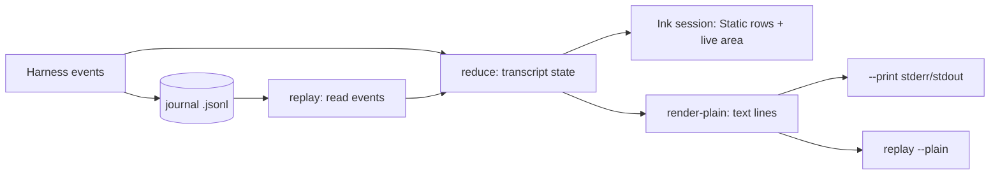
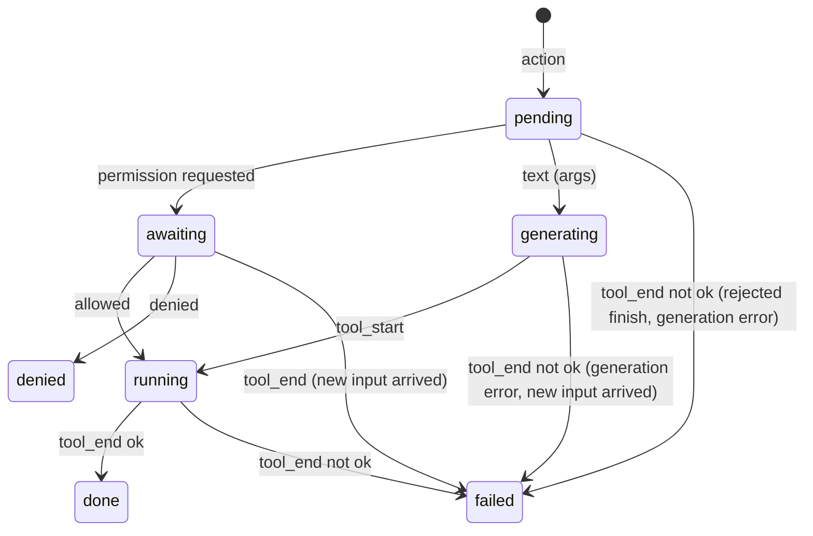

# Harness UX - Plan

## Goal Capsule

- **Objective:** Make a jev-code session read like a peer of Claude Code or Codex: a scrolling transcript of designed tool cards, a pinned live area that shows the file being built and the decision behind the current step, single-keypress approvals, and the same rendering for live, `--print`, and replay. Add a pipe utility that turns stdin into one Jev decision.
- **Product authority:** Roberto Montalti (sole maintainer). Decisions confirmed in dialogue on 2026-09-18.
- **Authority hierarchy:** Product Contract, then Planning Contract, then Implementation Units. Repo conventions in the root instructions override unit approach notes where they conflict.
- **Execution profile:** Land the transcript model and plain renderer first, then the pipe utility (it depends only on the event shape), then the Ink session, then approvals (the old terminal is deleted here, once approvals work), then trace, then replay, then degradation and docs. Each unit is verifiable on its own.
- **Stop conditions:** a unit's verification fails after one fix attempt; a change to a `--json` event shape is required beyond adding fields; the TUI cannot render on stderr with the prompt on stdin.
- **Open blockers:** none. The three questions the brainstorm deferred are resolved in KTD5, KTD6, and KTD7.
- **Product Contract preservation:** unchanged.
- **Shipping:** no PR. When reviewed and green, fast-forward `main` and push it directly.

---

## Product Contract

### Summary

Replace the hand-rolled ANSI session with a terminal UI built on a full TUI framework, laid out as a scrolling transcript plus a sticky live area. One replayable transcript model drives the live view, plain `--print` output, and a new `replay <run-id>` command over any saved journal. A `decide` subcommand makes Jev usable in shell pipelines: stdin in, one choice or score out, exit code mapped to the answer.

### Problem Frame

Generation improved on the previous plan, but the surface still looks like a script. Tool lines are flat one-color text painted by regex on words like "error". Permission prompts dump raw JSON. Edits show no diff. Decision confidence is counted but never shown. Non-TTY mode reprints the whole source on every AST production. Jev's distinctive property, that every step is a constrained choice with a probability, is invisible to the person watching.

The audience is wider than one terminal: README recordings, live demos, contributors on tmux and odd terminals, and shell pipelines that want a decision, not a coding session.

### Key Decisions

- **Full TUI framework over hand-rolled ANSI.** The project has had zero UI dependencies. A framework buys layout, redraw, and raw keypress handling that the session needs; the cost is a larger dependency tree and installer bundle. Accepted.
- **Transcript plus sticky live area.** Of three sketched shapes (transcript with sticky live area, split workbench, compact timeline) the first was chosen. The transcript scrolls and stays in scrollback; the live draft pane and input are pinned at the bottom. Alternate-screen and split layouts are out.
- **One replayable transcript model.** Journal events reduce to a transcript state that the live view, `--print`, and `replay` all render. Demos, GIFs, and eval journals become replayable from a file, and the decision trace is a view over state the model already holds.
- **Decisions are visible on demand.** A one-line strip under the live pane always shows the current slot, chosen production, and confidence. A trace command expands recent decisions with the alternatives Jev rejected and their probabilities.
- **Approvals are a card and a keypress.** The prompt shows the same card the transcript would show for the tool, then takes `y`, `n`, or `a` (allow this tool for the session). No typing, no editing of the command.
- **Renderer-free paths stay renderer-free.** `--print`, `--json`, `decide`, and `replay --plain` never load the TUI framework.

### Actors

- A1. **Operator:** the person running a session in a terminal, approving tools, typing updates, and reading results.
- A2. **Viewer:** someone watching a recording, a screen share, or a replay without interacting.
- A3. **Shell pipeline:** a script or one-liner that pipes text into `decide` and branches on the exit code or parses the JSON answer.
- A4. **Jev:** the decision model whose choices, confidences, and rejected alternatives the UI displays.

### Requirements

**Transcript**

- R1. Every harness event type has a designed rendering in TTY, `--print`, and replay; no event prints raw JSON or a flat one-color line.
- R2. Each tool call is a card: status glyph, tool name, target (path or command), timing, request count, and a clipped body.
- R3. A file write card shows the first lines of the file with line numbers and syntax highlighting, then a count of remaining lines and how to expand.
- R4. An edit card shows the change as a unified diff hunk with removed and added lines distinguished.
- R5. A run card shows the command, exit code, duration, and the first lines of output, clipped with a count of remaining lines.
- R6. A multi-file write card lists every written path and is tracked by the files command like single-file writes.
- R7. Turn boundaries, task updates, cancellation, and the end-of-run summary are distinct rows, not indented prose.
- R8. The end-of-run summary states the outcome, the facts from tool records, and the budget spent, in a fixed shape shared by TTY and `--print`.

**Live area**

- R9. While Jev generates, a pinned pane shows the file being built with the current slot marked, sized to the terminal, redrawn without flicker.
- R10. A one-line decision strip under the pane shows the current slot, the chosen production, its confidence, and the running request count.
- R11. A low-confidence pick is marked in the strip.
- R12. The status line shows elapsed time, turn, requests used against the budget, and the active phase.
- R13. A trace command lists the last N decisions with, for each, the chosen option, its probability, and the rejected alternatives with theirs.
- R14. Typing an update while Jev works keeps the transcript and live pane stable; the update is echoed as its own row when applied.

**Approvals**

- R15. A tool that needs permission is shown as the card it would produce, with the command or diff visible before the operator answers.
- R16. The operator answers with a single keypress: `y` allows once, `n` denies, `a` allows this tool for the rest of the session.
- R17. Denial is recorded as a card and the run continues with Jev informed, matching current behavior.

**Replay**

- R18. `replay <run-id>` renders a saved journal through the same transcript model as a live run, at a chosen speed or instantly.
- R19. Replay works for eval journals as well as interactive journals.
- R20. A journal carries a schema version so replay can refuse or adapt to journals from other versions.

**Non-interactive surfaces**

- R21. `--print` renders the same cards as the transcript in plain text with no cursor movement, spinners, or color unless the output is a TTY and color is allowed.
- R22. `--json` keeps emitting one event per line; the new UI changes no existing event shape and only adds fields.
- R23. Non-TTY output never reprints the full source on each production; it reports steps and prints the final source once.

**Pipe utility**

- R24. `decide "<question>" --choices a,b,c` reads stdin, asks Jev one choice question over the text, and prints the chosen label and its confidence.
- R25. The process exit code maps to the chosen option's position, so a shell can branch on it without parsing.
- R26. `decide --score "<criteria>"` reads stdin and prints a score with its distribution; `--lines` scores each stdin line separately and prints them ranked.
- R27. `decide --spec <file>` runs several questions described in a JSON spec over the same stdin and prints one JSON answer per question.
- R28. Every `decide` answer is also available as `--json`, in the same event shape as a run's decision events.
- R29. `decide` never runs tools, never writes files, and never loads the TUI.

**Degradation**

- R30. Narrow terminals collapse the live pane to the decision strip and shorten cards without breaking lines mid-word.
- R31. `NO_COLOR`, `TERM=dumb`, and non-TTY output produce readable output with no color codes and no cursor garbage.
- R32. Under tmux and over SSH the redraw stays legible; the pinned area redraws only when its content changes.

### Key Flows

- F1. Watching a write
  - **Trigger:** Jev chooses `write_file`.
  - **Actors:** A1, A4
  - **Steps:** The live pane appears with the path and an empty body. Each production updates the marked slot and the decision strip. When the AST completes, the pane freezes, the tool runs, and the pane content becomes a write card in the transcript. The live area returns to the status line.
  - **Covered by:** R2, R3, R9, R10, R11

- F2. Approving a command
  - **Trigger:** Jev chooses `bash` in a permission mode that asks.
  - **Actors:** A1, A4
  - **Steps:** A run card appears in pending state with the command. The status line reads `y allow · n deny · a always`. One keypress resolves it. The card updates to running, streams output, then settles with exit code and duration.
  - **Covered by:** R5, R15, R16, R17

- F3. Inspecting a bad pick
  - **Trigger:** The operator sees a low-confidence mark in the decision strip.
  - **Actors:** A1, A4
  - **Steps:** The operator types the trace command. The transcript gains a trace card listing the last N decisions, each with the winner, its probability, and the rejected alternatives. The operator types an update or lets the run continue.
  - **Covered by:** R11, R13, R14

- F4. Replaying an eval journal
  - **Trigger:** A maintainer wants to see why an eval run failed.
  - **Actors:** A2
  - **Steps:** `replay <run-id>` finds the journal, checks its version, and renders the whole run instantly or at a chosen speed with the same cards and live pane a live viewer saw.
  - **Covered by:** R18, R19, R20

- F5. Branching a script on Jev
  - **Trigger:** A shell one-liner pipes text into `decide`.
  - **Actors:** A3, A4
  - **Steps:** `decide` reads stdin, asks one question, prints the label and confidence, exits with the option's index. The script branches on the exit code or reads `--json`.
  - **Covered by:** R24, R25, R28, R29

### Acceptance Examples

- AE1. **Covers R4.** Given Jev edits `main.py` replacing `print('Correct', None)` with `print('Correct')`, when the edit card renders, then it shows one removed line and one added line, each marked, and no other file content.
- AE2. **Covers R11, R13.** Given a decision with probability 0.41 for the winner and 0.39 for the runner-up, when the strip renders, then the pick is marked low-confidence, and the trace lists both options with their probabilities.
- AE3. **Covers R16.** Given a permission prompt for `bash`, when the operator presses `a`, then the command runs and no later `bash` call in this session prompts.
- AE4. **Covers R21, R23.** Given `--print` and a 14-line write, when the run finishes, then the output contains the write card once with the final source, no partial sources, and no escape codes when stdout is not a TTY.
- AE5. **Covers R25.** Given `printf 'Traceback...' | jev-code decide "Is this an error?" --choices yes,no`, when Jev picks `yes`, then stdout is `yes 0.93` (label and confidence) and the exit code is 0; picking `no` exits 1.
- AE6. **Covers R26.** Given three lines on stdin and `--score "relevance to the task" --lines`, when Jev scores them, then the output lists the three lines ordered by expected score with the score beside each.
- AE7. **Covers R30.** Given a 60-column terminal during generation, when the live area renders, then the file pane is hidden, the decision strip remains, and no card line is broken mid-word.
- AE8. **Covers R18, R20.** Given a journal written by an older schema version, when `replay` runs, then it either adapts and renders, or exits with a message naming both versions; it never renders garbage.

### Success Criteria

- A recorded run of the guessing-game eval task, placed next to Claude Code doing the same task, reads as a peer product, not a prototype.
- Every event type has a snapshot test in TTY and `--print` renderings.
- A documented shell one-liner using `decide` works end to end, for example gating a commit on a diff verdict.
- Narrow terminal, `NO_COLOR`, tmux, and non-TTY each produce readable output with no cursor garbage, verified by tests where possible and a manual checklist otherwise.

### Scope Boundaries

- Eval runner output keeps its current per-task line and compare table.
- No editing of a command or path inside the approval prompt.
- No alternate-screen dashboard and no split workbench layout.
- No change to how Jev generates code; this plan only changes what is shown and how the CLI is driven.
- No web or desktop surface.

### Dependencies / Assumptions

- The TUI framework will be a React-based terminal renderer or equivalent; the exact library is a planning decision. Assumed to handle raw-mode keypresses, width changes, and diff-based redraw.
- Decision events today carry the chosen option, confidence, and its probability, but not the alternatives. R13 needs a bounded alternatives table (winner plus up to three runners-up, per KTD5) and slot identity in the event and the journal.
- The installer bundles a private Node runtime; a larger dependency tree grows that bundle. Assumed acceptable.
- `decide` requires an API key like every other live command.

### Outstanding Questions

**Deferred to Planning**

- Journal growth from full probability tables: store every table, or only tables where the winner's probability is below a threshold, or cap the alternatives kept per decision.
- Where `--print` writes cards: today progress goes to stderr and the result to stdout; keep that split, or write the whole transcript to stdout when stdout is not a TTY.
- Exit-code mapping for `decide` when more than 125 choices are given or when Jev's answer fails confidence checks.

### Sources / Research

- Current rendering: `src/terminal.ts`, `src/terminal-style.ts`, `src/draft.ts`, `src/summary.ts`, `src/cli.ts`.
- Event shapes and decision data: `src/types.ts` (`HarnessEventData`, `DecisionEventData`).
- Journals: written under `.jev/runs` for sessions and `.jev/eval/journals/<task>/` for eval runs.
- Previous plan, generation side: `docs/plans/2026-09-18-001-feat-generation-power-plan.md`.
- Grounding dossier from this brainstorm: `/tmp/compound-engineering/ce-brainstorm/ux-2026-09-18/grounding.md` (session-local, not committed).

---

## Planning Contract

### Key Technical Decisions

- **KTD1. Ink 6 with React 19 as the TUI, rendered to stderr.** Ink gives `Static` for permanent scrollback rows, a redrawn tail for the live area, `useInput` raw-mode keypresses, and `ink-testing-library` frame snapshots. The session keeps writing UI to stderr and reading stdin, as today, so `--json` on stdout stays clean. Alternate screen stays off (`alternateScreen: false`). Runtime deps added: `ink`, `react`, `ink-text-input`. Type deps: `@types/react`. Dev deps: `ink-testing-library`. `tsconfig.json` gains `jsx: react-jsx` and its `include` becomes `src/**/*.ts` plus `src/**/*.tsx`; `tsconfig.test.json` adds `src/**/*.tsx` and `test/**/*.tsx`; the `test` script becomes `tsx --test test/*.test.ts test/*.test.tsx`. UI files are `.tsx` under `src/ui/`. `src/cli.ts` loads the session with a dynamic `import('./ui/session.js')` inside the interactive branch only, and `src/index.ts` re-exports nothing from `src/ui/`, so `--print`, `--json`, `decide`, and `replay --plain` never load Ink or React. The interactive session requires both stdin and stderr to be TTYs; otherwise the CLI falls back to the plain path.
- **KTD2. A pure transcript reducer is the single rendering truth.** `src/transcript.ts` exports `reduce(state, event)` over `HarnessEvent | SessionEvent` and a `TranscriptState` of ordered items (prompt, tool card, turn row, update row, trace card, summary) plus a live region (path, source with pending marker, decision strip, status). `SessionEvent` is session-local (`permission` with tool and args, `permission_result` with tool and allowed, `host_command` for `!` shell runs), emitted only by `src/ui/session.ts` and never written to the journal or `--json`. Live Ink, `--print`, and `replay` all consume this state. No renderer reads raw events.
- **KTD3. Two renderers, one state.** `src/render-plain.ts` turns a state into text lines (cards, hunks, clipped bodies) for `--print` and `replay --plain`. `src/ui/*.tsx` renders the same state in Ink. Card bodies are computed once in the reducer (clipped source, diff hunk, output head) so both renderers show identical content.
- **KTD4. Diff hunks come from a small line-level LCS in `src/diff.ts`.** An edit's `old_text` and `new_text` are short; a hand-written LCS over lines is a few dozen lines and avoids a dependency. Output is a unified hunk with `-`/`+` markers, context lines capped at 2.
- **KTD5. Decision events carry a bounded alternatives table and slot identity.** `DecisionEventData` gains `options?: Array<{ label, probability }>` holding the winner and up to three runners-up, sorted by probability, plus optional `field`, `phase`, `slot`, `unit`, and `candidate`, copied by `Decisions` from `state.generation` when present. That bounds journal growth to four entries per decision and lets the reducer pair a decision with the slot it decided by `(field, unit, candidate, slot)` instead of arrival order, which matters because units and search candidates generate concurrently. Batched `chooseMany` decisions carry no `choice` and only advance the request counter. A slot filled without a request (one candidate) shows its production with no confidence. Low confidence means the winner is within 0.1 of the runner-up, or Jev's own `confidence` is under 0.5; there is no absolute probability threshold, since wide slots often have a decisive winner at 0.4.
- **KTD6. `--print` keeps stderr for progress and stdout for the result.** Cards render to stderr as the run proceeds; the fixed-shape summary goes to stdout at the end. This keeps `jev-code --print ... | tail -1` style usage working and keeps `--json` unaffected.
- **KTD7. `decide` exit codes: option index for choices, 0 for scores, 125 for failure.** Choice indices are 0-based; up to 100 choices are allowed so indices stay in 0 to 99 and never reach 125, which is reserved for a confidence failure, missing key, or bad arguments (including a single choice, since a choice question needs at least two); on failure the reason goes to stderr. `--score` and `--lines` exit 0 and put the result on stdout.
- **KTD8. Journal schema version lives on the `start` event.** `start.data.schema: 1`. Replay reads the first line. A higher version is refused with a message naming both versions. A missing field means version 0, which replays best-effort with a warning.
- **KTD9. The old `TerminalSession` is deleted, not kept behind a flag.** Its session commands (`/help`, `/status`, `/plan`, `/history`, `/files`, `/show`, `/clear`, `/cancel`, `/permissions`, `/paste`, `/exit`), Tab completion, and the `!<command>` direct host shell (run through `runBash`, streamed into a run card, result passed to `harness.observe`) move into the Ink prompt; `/trace` is added. `--interactive` semantics and `--demo` remain. The deletion lands with U4, after approvals work, so the default `ask` mode never ships without a way to approve.

### High-Level Technical Design

Tool card lifecycle inside the reducer:

`finish` and `blocked` actions produce a summary item from the `end` event rather than a tool card. `permission` and `permission_result` are session events (KTD2), never journaled.

The live region holds only the current generation: path, source with `__jev_pending__`, the last decision, and counters. When a `tool_end` arrives the live region empties and the finished card joins the static rows.

`decide` bypasses the harness: it builds a `Decisions` instance over `JevProvider`, asks one `choose` or `score`, and prints. Its `--json` output reuses the `decision` event shape with a synthetic `runId`.

### Assumptions

- Ink's `Static` plus a redrawn tail is enough to keep scrollback stable under tmux; if flicker appears, `incrementalRendering: true` is the first lever.
- `install.sh` runs `npm ci --ignore-scripts` from the source tarball, so new dependencies need only a committed `package-lock.json`; no installer change is expected. Ink and React have no install scripts.
- Syntax highlighting keeps using the existing regex highlighter in `src/terminal-style.ts`; no highlighting library is added.

---

## Implementation Units

### U1. Transcript model and event additions

- **Goal:** One pure reducer that turns harness events into transcript state, plus the event additions the UI needs.
- **Requirements:** R1, R2, R6, R7, R8, R10, R11, R13, R20, R22; A4.
- **Dependencies:** none.
- **Files:** create `src/transcript.ts`, `src/diff.ts`, `test/transcript.test.ts`, `test/diff.test.ts`, `test/fixtures/events-baseline.jsonl`; modify `src/types.ts` (`DecisionEventData.options` and identity fields, `start.data.schema`), `src/decisions.ts` (populate `options` and identity from `state.generation`), `src/harness.ts` (schema on `start`), `src/summary.ts` (export a structured summary the reducer can hold).
- **Approach:** Before touching `src/types.ts`, capture the `--json` output of a scripted-provider run into `test/fixtures/events-baseline.jsonl`; the U2 compatibility test diffs against it. `TranscriptState` holds `items: Item[]` and `live: Live | undefined`. Items: `prompt`, `tool` (status, tool, target, args, body, timing, requests, exit code), `turn`, `update`, `trace`, `summary`. Tool bodies are precomputed: write cards clip to the first 8 lines with a remaining count and the expand hint `/show <path>`; edit cards hold the hunk from `src/diff.ts`; run cards hold the first 6 output lines; multi-file cards list up to 8 paths with a remaining count. `decision` events matching the live slot by `(field, unit, candidate, slot)` update `live.decision` and push to a ring of the last 20 decisions for `/trace`; before the first decision the strip holds a fixed `choosing…` placeholder. A `tool_end` with no `tool_start` (rejected finish, generation error, new input) fails the pending card. `tool_end` moves the live card into items. Journals gain `schema: 1` on `start`. `Decisions` fills `options` from the answer's probability map (top 4).
- **Patterns to follow:** `completionSummary` in `src/summary.ts` for fact extraction; `formatSearchOutcome` in `src/grid.ts` for the search line text.
- **Test scenarios:**
  - Happy path: a scripted event sequence (start, turn, action, text, tool_start, tool_output, tool_end, turn_end, end) yields items in order with the write card carrying 8 lines and a remaining count.
  - Edit: `old_text`/`new_text` of one changed line yields a hunk with one `-` and one `+` line and at most 2 context lines (Covers AE1).
  - Decisions: a decision with options 0.41 and 0.39 marks `lowConfidence` and the ring holds both options (Covers AE2).
  - `write_files`: the card lists every path from `result.data.paths` and the files set includes them.
  - Non-completed statuses (`limited`, `cancelled`, `error`) produce a summary item with the status and reason.
  - Diff edge cases: identical texts yield an empty hunk; all lines changed yields all `-` then all `+`; trailing newline differences do not produce phantom lines.
  - Schema: `start` carries `schema: 1`; the reducer records it on state.
  - Rejected finish: `action: finish` then `tool_end` ok:false with no `tool_start` yields a failed card with the rejection text.
  - Concurrency: decisions for two units interleaved arrive with different `unit` fields and each pairs with its own slot; a decision with no `choice` (batched) leaves the strip unchanged and increments the counter.
  - Placeholder: before any decision the live strip reads `choosing…` in both renderers.
- **Verification:** `npm test` passes `test/transcript.test.ts` and `test/diff.test.ts`; the baseline fixture is committed before the event changes.

### U2. Plain renderer and non-interactive paths

- **Goal:** Render transcript state as text for `--print`, and stop non-TTY runs from reprinting sources.
- **Requirements:** R1, R8, R21, R22, R23, R31.
- **Dependencies:** U1.
- **Files:** create `src/render-plain.ts`, `test/render-plain.test.ts`; modify `src/cli.ts` (one-shot path uses the reducer and renderer), `src/draft.ts` (remove the non-TTY full-source reprint), `test/draft.test.ts`.
- **Approach:** `renderItem(item, opts)` returns lines for one item; `renderSummary(summary)` returns the fixed-shape block. Color only when the target stream is a TTY and `terminalColor` allows it. The one-shot path feeds every event through `reduce`, prints each newly completed item to stderr as it lands, and writes the summary to stdout at the end (KTD6). Step progress in non-TTY prints one short line per AST production and the final source once (R23).
- **Patterns to follow:** existing `paint` and `highlightCode` in `src/terminal-style.ts`; the current one-shot writer in `src/cli.ts`.
- **Test scenarios:**
  - Snapshot per item type: prompt, write card, edit card, run card, multi-file card, turn row, update row, trace card, summary, each in color-off mode.
  - `--print` end to end with the scripted provider: stderr holds the cards once, stdout holds only the summary, and no escape codes appear when streams are not TTYs (Covers AE4).
  - Non-TTY generation of a 14-line file prints step lines and the source exactly once.
  - `--json` compatibility: the scripted run from U1's fixture is re-run; after masking `runId`, `timestamp`, `elapsedMs`, and `durationMs` on both sides and deleting the new `schema`, `options`, and identity fields from the new output, the two event streams are deeply equal.
  - The one-shot `Execute? [y/N]` prompt on a TTY without `--yes` renders the pending card before asking.
  - `test/draft.test.ts` keeps only the cases that still have a production caller after the non-TTY reprint is removed.
- **Verification:** `npm test`; `npm run dev -- --print "..."` with a scripted-provider fixture produces the documented shape.

### U3. Ink session: transcript, live area, prompt

- **Goal:** Replace `TerminalSession` with an Ink app driven by the transcript state.
- **Requirements:** R1, R2, R3, R4, R5, R7, R9, R10, R11, R12, R14, R30, R32; A1.
- **Dependencies:** U1, U2.
- **Files:** create `src/ui/app.tsx`, `src/ui/transcript-view.tsx`, `src/ui/live-area.tsx`, `src/ui/prompt.tsx`, `src/ui/session.ts` (harness wiring, command handling, `!` host shell), `test/ui-session.test.tsx`; modify `package.json` (deps, test glob), `tsconfig.json`, `tsconfig.test.json`. The `src/cli.ts` mount and the deletion of `src/terminal.ts` happen in U4.
- **Approach:** `render(<App/>, { stdout: process.stderr, stdin: process.stdin, patchConsole: false, exitOnCtrlC: false })`. `App` holds `TranscriptState` in React state; harness events go through `reduce` and `setState`. Completed items render inside `Static`; the live region and prompt render below it. The live pane shows the last N lines of the source sized to `rows - reserved`, collapsing to the decision strip alone under 80 columns (R30). Redraw only on state change; text events are throttled to 50 ms as today. Ctrl-C cancels a run or exits at an idle prompt, matching current behavior. Session commands are dispatched from the prompt component; `/show` uses the highlighter; `/files` includes `write_files` paths.
- **Execution note:** Build the session against `test/helpers.ts` scripted providers and compare frames to the plain renderer's lines for the same events; the old terminal stays in place until U4.
- **Patterns to follow:** current command handling in `src/terminal.ts` (`COMMANDS`, `/status`, `/history`, `/paste` flow); throttling in `progress()`.
- **Test scenarios:**
  - A scripted run renders one `Static` row per completed item in order and the frame ends with the status line and prompt.
  - During generation the live pane shows the pending marker line and the decision strip with slot, production, confidence, and running request count.
  - `!printf hi` at an idle prompt renders a run card, streams output, and the next run's state includes the observed record.
  - `npm run build` emits `dist/ui/app.js` and `node dist/cli.js --help` exits 0 without loading `ink` (checked by inspecting loaded modules in a child process).
  - Low-confidence decisions show the mark in the strip (Covers AE2).
  - Typing an update mid-run keeps prior rows intact and adds an update row when applied.
  - At 60 columns the live pane is absent, the strip is present, and no line exceeds the width (Covers AE7).
  - Ctrl-C during a run cancels; at an idle prompt it exits.
  - `NO_COLOR` produces frames without escape codes.
- **Verification:** `npm test` including the new UI tests; a manual run in tmux shows no flicker and scrollback keeps completed cards.

### U4. Approvals as cards with keypresses

- **Goal:** Permission prompts render the pending card and resolve on one key.
- **Requirements:** R15, R16, R17.
- **Dependencies:** U3.
- **Files:** create `src/ui/approval.tsx`; modify `src/ui/session.ts` (authorize callback, per-tool session allow set), `src/cli.ts` (dynamic import of the session in the interactive branch), `src/index.ts` (drop the `TerminalSession` export), `test/ui-session.test.tsx`; delete `src/terminal.ts` and `test/terminal.test.ts`.
- **Approach:** The harness `authorize` callback dispatches a `permission` session event, returns a promise resolved by the approval component, then dispatches `permission_result`. The card renders in `awaiting` status with the command or hunk; the status line's content is replaced by `y allow · n deny · a always` for the duration of the prompt and reverts afterwards. While awaiting, the text input's `useInput` is inactive (`isActive: false`) so keys reach only the approval component. `a` adds the tool name to a session set consulted before prompting. Denial records a card with `denied` status and the existing "Host declined" record continues the run.
- **Patterns to follow:** current `permissionMode` and `answerPermission` logic in `src/terminal.ts`.
- **Test scenarios:**
  - `y` runs the tool once and the next call prompts again.
  - `a` runs the tool and no later call of that tool prompts (Covers AE3).
  - `n` records a denied card and the run continues.
  - Keys other than y/n/a are ignored while awaiting.
  - `--yes` (and `/permissions auto`) never prompts.
  - Typing during an awaiting prompt does not reach the input box.
- **Verification:** `npm test`; a manual run without `--yes` shows the card for `bash` and resolves on a keypress; nothing imports `src/terminal.ts`.

### U5. Decision strip and trace command

- **Goal:** Expose Jev's decisions: the strip under the pane and `/trace`.
- **Requirements:** R10, R11, R13.
- **Dependencies:** U1, U3.
- **Files:** modify `src/ui/live-area.tsx`, `src/ui/session.ts` (`/trace [n]`), `src/render-plain.ts` (trace card), `test/ui-session.test.tsx`, `test/render-plain.test.ts`.
- **Approach:** `/trace` pushes a `trace` item built from the reducer's decision ring: one line per decision with slot, winner and probability, then the runners-up. Default N is 10, max 20.
- **Test scenarios:**
  - `/trace` after three decisions lists three rows with winner and alternatives (Covers AE2).
  - `/trace 1` lists only the latest.
  - `/trace` with no decisions yet prints an empty-state row.
- **Verification:** `npm test`.

### U6. Replay command

- **Goal:** Render any saved journal through the same model.
- **Requirements:** R18, R19, R20; A2.
- **Dependencies:** U1, U2, U3.
- **Files:** create `src/replay.ts`, `test/replay.test.ts`; modify `src/cli.ts` (`replay <run-id> [--speed x] [--plain]`), `src/ui/app.tsx` (accept a pre-supplied event source).
- **Approach:** Locate the journal by run id under `.jev/runs/` then `.jev/eval/journals/*/`. Check the `start` event's `schema` (KTD8). Feed events through the reducer; with `--plain` print via `render-plain`, otherwise mount the Ink app in read-only mode (no prompt, no approvals) and pace events by their `elapsedMs` deltas divided by `--speed` (default instant), capping any single gap at 2 seconds. Ctrl-C exits replay immediately.
- **Test scenarios:**
  - A journal from a scripted run replays to the same plain lines as the original `--print` output.
  - An eval journal path resolves and replays.
  - A journal without `schema` replays with a warning; a journal with `schema: 2` exits with a message naming 2 and 1 (Covers AE8).
  - Unknown run id exits non-zero with a one-line error.
  - Ctrl-C during a paced replay exits at once.
- **Verification:** `npm test`; `npm run dev -- replay <id> --plain` on a journal from this session prints readable cards.

### U7. `decide` pipe utility

- **Goal:** One Jev decision from stdin, composable in shell.
- **Requirements:** R24, R25, R26, R27, R28, R29; A3.
- **Dependencies:** U1 (event shape only).
- **Files:** create `src/decide.ts`, `test/decide.test.ts`; modify `src/cli.ts` (subcommand and flags), `src/index.ts` (export).
- **Approach:** Read all of stdin and build the state through `buildDecisionContext` (`src/decision-context.ts`) with the text as the shrinkable part and `MAX_GRID_REQUEST_BYTES` as the budget, printing `input truncated to N bytes` on stderr when it shrinks. Build `Decisions` over `JevProvider` with a request budget of the question count plus a margin (`--lines` needs one request per line). Modes: `--choices a,b,c` asks one `choose` with the labels as criteria and the text as state; `--score "<criteria>"` asks one `score` over a fixed rubric derived from the criteria; `--lines` splits stdin and scores each line, printing them ranked; `--spec file.json` runs an array of `{ question, choices? , score? }` and prints one JSON line each. Output: `label confidence` on stdout for choices, `score` for scores; `--json` prints the `decision` event shape. Exit codes per KTD7. Never imports `src/ui/*`.
- **Patterns to follow:** `Decisions.choose` and `Decisions.score` in `src/decisions.ts`; `sanitizedEnv` is irrelevant here (no subprocess).
- **Test scenarios:**
  - Choice with a scripted provider prints `yes 0.93`-shaped output and exits with the chosen index (Covers AE5).
  - `--lines` over three lines prints them ranked by expected score (Covers AE6).
  - `--spec` with two questions prints two JSON lines.
  - Missing API key exits 125 with a message; more than 100 choices or a single choice exits 125.
  - Confidence failure from the provider exits 125 and prints the reason to stderr.
  - Oversized stdin is shrunk to the request budget and the truncation note appears on stderr.
  - `--json` output parses as a `decision` event.
- **Verification:** `npm test`; a documented one-liner (`git diff | jev-code decide "Is this change safe to commit?" --choices yes,no && echo ok`) runs end to end with a real key.

### U8. Degradation, docs, and installer check

- **Goal:** The session degrades cleanly and the docs describe the new surface.
- **Requirements:** R30, R31, R32; success criteria.
- **Dependencies:** U3, U6, U7.
- **Files:** modify `docs/guide.md` (session, replay, decide, degradation), `README.md` (one screenshot-free paragraph and the pipe example).
- **Approach:** Run the manual checklist: 60-column window, `NO_COLOR=1`, `TERM=dumb`, tmux pane, `ssh localhost`, non-TTY pipe. Record findings in the guide's degradation paragraph. In a fresh `git archive HEAD` copy, run the exact block `install.sh` executes (`npm ci --ignore-scripts --no-audit --no-fund && npm run build && npm prune --omit=dev --ignore-scripts --no-audit --no-fund && node dist/cli.js --help`) and confirm it succeeds with the committed `package-lock.json`.
- **Test scenarios:** Test expectation: none beyond U2/U3 automated cases; this unit is a checklist and documentation.
- **Verification:** `npm run typecheck && npm test`; the guide documents `/trace`, `replay`, `decide`, and the degradation rules; a recorded run of the guessing-game task exists under `docs/` or is linked from the README.

---

## Verification Contract

| Gate | Command | Applies to | Done signal |
| --- | --- | --- | --- |
| Types | `npm run typecheck` | all units | exit 0 |
| Unit and snapshot tests | `npm test` | all units | all pass except the pre-existing installer bootstrap test on this machine |
| Event compatibility | `npm test` (fixture comparison in U2) | U1, U2 | equal to `test/fixtures/events-baseline.jsonl` after masking volatile fields and removing the added fields |
| Plain render parity | `npm test` (replay vs print case in U6) | U2, U6 | identical lines |
| Manual degradation | checklist in U8 | U3, U8 | no cursor garbage in any listed environment |
| Pipe one-liner | documented `decide` example with a real key | U7 | prints a label and exits with its index |

---

## Definition of Done

- Every unit's verification passes; `src/terminal.ts` is deleted, nothing imports it, and `!<command>` still works in the session.
- A scripted-provider run renders identically through `--print`, `replay --plain`, and the Ink frames (modulo layout).
- `--json` consumers see only added fields.
- `/trace`, `replay`, and `decide` are documented in `docs/guide.md`.
- Live eval still runs (`npm run dev -- eval`) with no change in records other than the added fields.
- Shipped by fast-forwarding `main` and pushing; no PR.

