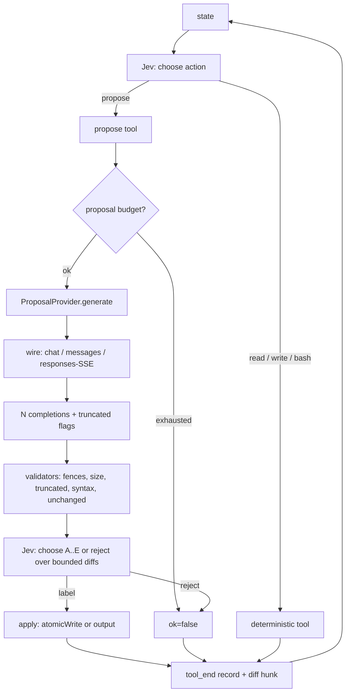
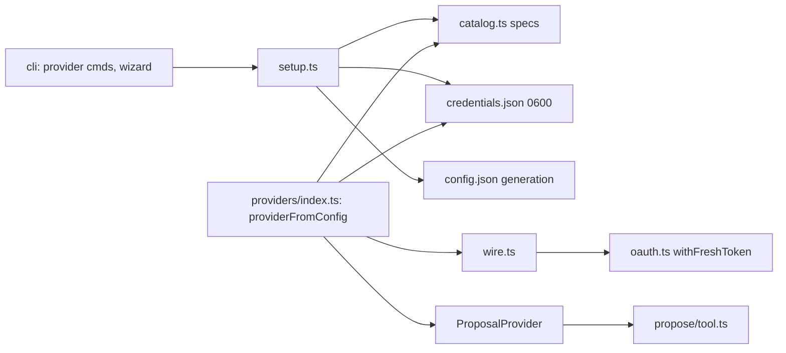

# Hybrid propose - Plan

## Goal Capsule

- **Objective:** Add one new action, `propose`, that Jev can select like any other tool. It asks a small autoregressive model for N candidates, filters them with deterministic validators, lets Jev select one or reject all, and applies the selection. Add a provider layer (OpenAI, Anthropic, Google, OpenRouter, OpenAI-compatible, Local) with API-key authentication for every provider and OAuth for OpenAI, Anthropic, and OpenRouter, a first-run setup wizard, and `jev-code provider ...` commands. Jev remains the only policy; the small model never chooses tools, plans, or ends the run.
- **Product authority:** Roberto Montalti (sole maintainer). Brief given in full on 2026-09-19.
- **Authority hierarchy:** Product Contract, then Planning Contract, then Implementation Units. Root instructions (no comments, short identifiers, pnpm, no `docs:` code commits, no model attribution in commits) override unit approach notes where they conflict.
- **Execution profile:** Land the provider layer and credential store first (U1-U3), then the propose tool and harness wiring (U4-U5), then CLI commands and the wizard (U6), then the end-to-end flow test and docs (U7-U8). Every unit has its own tests against local mock servers; no unit needs a real provider account.
- **Stop conditions:** a unit's verification fails after one fix attempt; a credential appears in any event, journal, log line, or error message; the harness run loop needs a change beyond the three touches named in KTD7.
- **Open blockers:** none. Inferred decisions are listed under Assumptions.
- **Shipping:** no PR. When reviewed and green, fast-forward `main` and push it directly.

---

## Product Contract

### Summary

jev-code becomes a hybrid: Jev (decision-only) stays the policy; a cheap generative model becomes a bounded candidate generator that runs only when Jev selects the `propose` action. TypeScript validators are the hard constraint between the two. The provider layer is independent from the harness: the harness sees one `ProposalProvider` and never learns how it authenticates.

### Problem Frame

Jev builds code one production at a time from bounded lists. That works for small programs and fails on open-ended synthesis (a function body that needs domain knowledge, prose, a regex). A small LLM can produce such text cheaply, but letting it plan or choose tools would turn jev-code into an ordinary agent. The design keeps the LLM as a graph expander: it proposes nodes; Jev navigates.

### Requirements

- **R1.** A `propose` tool is registered in the harness when a generation provider is configured and has a credential. Jev selects it through the existing action choice; nothing else triggers it.
- **R2.** Jev fills the proposal request through the existing argument generator: `kind` (enum), `objective` (string), `constraints` (string, may be empty), `count` (number, 1-5, default 3), and `path` (string, may be empty for `text`).
- **R3.** The provider returns `count` raw candidates. Deterministic code strips fences, drops empty, oversized, or length-truncated candidates, and for `kind=file` runs the language validator of the matching AST adapter (Python, JS, TS, C, Rust, Go, Lua, Ruby) and rejects a candidate that equals the current file after whitespace normalization.
- **R4.** Jev selects among the valid candidates or `reject`. One Jev `choice` request; its `decision` event carries `field=candidate`, `phase=propose`. The selection state carries bounded diffs or heads, never full candidate texts.
- **R5.** A selected `file` candidate is written atomically to `path`. A selected `text` candidate is returned as the tool output. `reject` and "no valid candidate" return `ok=false` with an output that tells Jev to change constraints or take another action. The next turn is Jev's, as for any tool.
- **R6.** The tool output and `tool_end.result.data` expose provider id, model, per-candidate validity with reason, selected label, confidence, and a bounded diff hunk. This appears in the journal, `--print`, `--json`, replay, and the session card.
- **R7.** Providers: `openai`, `anthropic`, `google`, `openrouter`, `openai-compatible`, `local`. Wire protocols: OpenAI chat completions (openai key path, google via its OpenAI-compatible endpoint, openrouter, openai-compatible, local), Anthropic messages (anthropic), OpenAI responses over SSE on the ChatGPT backend (openai OAuth path).
- **R8.** Authentication: API key for every provider except `local` (none). OAuth (authorization code + PKCE) for `openai` (loopback callback with `state`), `anthropic` (manual code paste with `state`), `openrouter` (loopback callback without `state`, then code-for-key exchange). Google OAuth is deferred (see Scope Boundaries).
- **R9.** OAuth tokens are refreshed once per `generate` when expired, and once more on a 401, with one in-flight refresh shared by concurrent calls; a failed refresh returns a clear "run `jev-code provider login <id>`" error. `provider logout` deletes the credential.
- **R10.** Non-secret settings live in `~/.config/jev-code/config.json` under `generation: { provider, model, auth, baseUrl }`. Secrets live in `~/.config/jev-code/credentials.json`, mode 600, keyed by provider id. Secrets never enter `config.json`, project files, events, journals, error messages, or child-process environments.
- **R11.** Commands: `provider login [id]`, `provider logout [id]`, `provider list`, `provider models [id]`, `provider use <id|none>`. `login` without `id` runs the wizard. Each prints one line per result and exits nonzero on failure.
- **R12.** First interactive run with no `generation` section asks whether to configure a provider. Decline is recorded as `generation: { provider: 'none' }` so the question is asked once. Non-interactive runs never prompt; without a usable provider `propose` is not registered and the harness behaves as today.
- **R13.** Model lists: each provider has bundled lightweight defaults; providers with a `/models` endpoint (openai key path, openrouter, openai-compatible, local, google) also list live models when a credential is present.
- **R14.** Generator calls have a per-run budget (`maxProposals`, default 20); exhaustion returns `ok=false` and names `write_file`/`edit_file` as the fallback.
- **R15.** All existing tests keep passing. The events baseline changes only by additive fields.

### Actors

- **A1. User** - configures a provider once, then runs tasks. Sees propose cards and `/trace` entries.
- **A2. Jev** - selects `propose`, fills the request, selects a candidate.
- **A3. Generator** - a small model behind a `ProposalProvider`; produces text only.
- **A4. Validators** - TypeScript; filter candidates.

### Key Flows

- **F1. Configure.** First run → wizard: provider → auth method → model. Credential saved to `credentials.json`, settings to `config.json`.
- **F2. Propose file.** Jev selects `propose` → args `{ kind: file, path: src/x.py, objective, constraints, count: 3 }` → three generations → validators mark A valid, B invalid (syntax), C valid → Jev selects C at 0.81 → `src/x.py` written → tool card shows the candidate table and the diff → next turn Jev runs tests via `bash`.
- **F3. Reject.** Jev selects `reject` → `ok=false` → Jev's next action is any tool, including `propose` again with new constraints. Two consecutive successful `propose` writes to the same path without a run trigger the existing "run it now" feedback.
- **F4. Token refresh.** Access token expired → one refresh before the fan-out → requests proceed. Refresh fails → tool result `ok=false` naming `provider login`.

### Acceptance Examples

- **AE1.** Given a mock OpenAI-compatible server that returns `["def f():\n  return 1\n", "def f(:\n", "def f():\n  return 2\n"]` for three requests and a scripted Jev that selects `propose` then candidate `C`, the run writes `return 2` to the file, the `tool_end` data lists `A valid, B invalid, C valid`, `selected=C`, and the following `bash` turn sees the new content.
- **AE2.** Given the same setup with Jev selecting `reject`, no file is written and the `tool_end` result is `ok=false`.
- **AE3.** Given a credential `sk-secret-123` from `credentials.json` or from `JEV_GENERATION_API_KEY`, no event, journal line, thrown error, child-process environment, or stdout/stderr text contains that string, including when the mock server returns 500 with the request echoed.
- **AE4.** Given an OAuth credential with `expires` in the past, a mock token endpoint, and `count: 3`, `generate` calls the token endpoint exactly once and the new tokens are persisted with mode 600.
- **AE5.** `jev-code provider use nonesuch` exits 1 with `Unknown provider: nonesuch. Known: openai, anthropic, google, openrouter, openai-compatible, local, none.`
- **AE6.** With no `generation` section and `--print`, the harness registers no `propose` tool and the events baseline test passes unchanged.

### Scope Boundaries

- Only `file` and `text` candidate kinds. Diffs, shell commands, plans, structured objects come later through the same `ProposalRequest.kind`.
- Only one selection question per propose (choose or reject). No scoring rubric, no pairwise ranking.
- No incremental candidates to Jev. A wire may stream internally (the ChatGPT backend requires SSE); the provider still returns complete strings.
- No system-keychain integration. `credentials.json` at mode 600 is the store; the read path is the single place to swap it later.

#### Deferred to Follow-Up Work

- Google OAuth. It needs the Cloud Code Assist onboarding endpoints and project discovery; this iteration uses API keys for Google.
- Moving the typesafe.ai key from `config.json` to `credentials.json`. Current storage is already mode 600; a migration is a separate small change.
- Server-side revocation of OAuth grants on `provider logout`. Logout deletes the local credential only.
- A `propose_again` shortcut. Jev can already select `propose` on the next turn.

### Key Decisions

- **Propose is a Tool with `effect: 'write'`.** It keeps `Harness`, `Tool`, journaling, and `tool_end` records unchanged, lets a host disable it by not registering it, and puts generator output under the same `--confirm-writes` gate as `edit_file`. A confirm-writes approval covers the request (path, objective, constraints); the content is reviewable only in the diff card afterwards. A successful `kind=text` propose resets the completion-rejection counter like any other ok write; accepted.
- **Selection happens inside the tool call, on the same turn.** The brief's flow is propose → validate → select → apply. Deferring selection to the next turn would need dynamic enum fields the argument generator does not support.
- **Full-file candidates, not unified diffs.** Small models produce broken hunks often; full files validate with the existing language validators and apply with `atomicWrite`. Length-truncated completions are rejected by a validator, so a cut-off file never reaches Jev.
- **N parallel single-completion requests instead of `n`.** Anthropic has no `n`; one code path for every wire. The credential is refreshed once before the fan-out.

---

## Planning Contract

### Key Technical Decisions

- **KTD1. Layout.** `src/propose/` holds the harness-facing side (`types.ts`, `validate.ts`, `tool.ts`). `src/providers/` holds the provider side (`types.ts`, `catalog.ts`, `wire.ts`, `oauth.ts`, `credentials.ts`, `setup.ts`, `index.ts`). `src/propose` imports only types from `src/providers/types.ts`; nothing in `src/providers` imports the harness.
- **KTD2. Interfaces.** `ProposalRequest { kind: 'file' | 'text'; objective: string; constraints: string; count: number; path?: string; current?: string }`. `Completion { text: string; truncated: boolean }`. `ProposalProvider { id: string; model: string; generate(req, signal): Promise<Completion[]> }` - `generate` rejects only with already-scrubbed messages; callers use the message as-is. `ProviderAuth { login(io): Promise<void>; logout(): Promise<void>; credential(): Promise<Credential | undefined> }`, produced by `authFor(spec, env)` in `oauth.ts` over the standalone credential and OAuth functions. `Credential = { type: 'api_key'; key: string } | { type: 'oauth'; access: string; refresh?: string; expires?: number; account?: string } | { type: 'none' }`.
- **KTD3. Provider spec table.** `catalog.ts` is data: `id`, `name`, `baseUrl`, `wire` (`openai-chat` | `anthropic-messages` | `openai-responses`), `discover: boolean`, `auth: Array<'oauth' | 'api_key' | 'none'>`, `models: Array<{ id: string; temperature?: number }>`, and an optional `oauth` descriptor: `authorizeUrl`, `tokenUrl`, `clientId`, `scopes`, `redirect: 'loopback' | 'paste'`, `port?` (fixed or ephemeral), `callbackPath`, `state: boolean`, `exchange: 'token' | 'key'`, and optional `wire`, `baseUrl`, `discover` overrides that apply when the resolved credential is `oauth`. OpenAI: key path `openai-chat` at `api.openai.com` with discovery; OAuth override `openai-responses` at the ChatGPT backend without discovery. OpenRouter: `redirect: loopback`, ephemeral port, `state: false`, `exchange: key`. Anthropic: `redirect: paste`, `state: true`, `exchange: token`. Adding a provider means adding a row and, at most, a wire function.
- **KTD4. Single HTTP client.** `wire.ts` exposes `complete(spec, cred, model, prompt, signal): Promise<Completion>` and `listModels(spec, cred, signal)`. Every request uses `AbortSignal.any([signal, AbortSignal.timeout(60_000)])`. It builds headers per wire and credential, never logs them, and passes every error leaving the module (HTTP status bodies, `fetch` rejections and their `cause`, parse errors, timeouts) through `scrub()`, which removes `Bearer <token>`, `sk-...`, and any header value it sent. `truncated` is derived from `finish_reason === 'length'` (chat), `stop_reason === 'max_tokens'` (messages), `status === 'incomplete'` (responses).
- **KTD5. OAuth module.** `oauth.ts` implements PKCE (S256), a loopback `http` server bound to `127.0.0.1` with a 120 s timeout, a manual-paste fallback through `promptSecret`, token exchange, refresh, and OpenRouter's code-for-key exchange. `state` is validated only when the descriptor sets `state: true`, on both loopback and paste. Paste accepts `code#state`, a bare code, or a full redirect URL whose query holds `code` (and `state`). Provider specifics come only from the descriptor. Browser opening uses `open`/`xdg-open` when available and always prints the URL. `withFreshToken(spec, cred, env, fn)` refreshes before `fn` when `expires` is past, retries once on 401, and shares one in-flight refresh promise across concurrent callers; refresh applies only to `oauth` credentials.
- **KTD6. Credentials file.** `credentials.json` is `{ [providerId]: Credential }`, written with `mkdir 0700` and `writeFile 0600` following `writeConfig`. `JEV_CODE_CONFIG_DIR`/`XDG_CONFIG_HOME` are honored. Environment override: `JEV_GENERATION_API_KEY` wins over the stored credential for the configured provider (mirrors `TYPESAFE_API_KEY`) and is stripped from child processes by `sanitizedEnv()` in `src/env.ts`.
- **KTD7. Harness wiring (three touches, nothing else).** (1) `ToolContext` gains `select?(instruction, criteria, extra): Promise<{ choice, confidence }>`; the harness sets `context.select` each turn to a closure over the turn's `state` and `decisions.choose`, so the candidate decision is a normal Jev request under the request budget and appears as a `decision` event. (2) `ToolContext` gains `proposals?: { used: number; max: number }`, created per run from `HarnessOptions.maxProposals` (`--max-proposals`, default 20). (3) `writtenPath()` also returns `args.path` for an ok `propose` record with `kind === 'file'`, so the rewrite guard covers proposals.
- **KTD8. Candidate labels and selection state.** Labels `A`..`E`. Each label's criterion is the first line where that candidate differs from every other valid candidate (fallback: first non-empty line), prefixed with `+n/-m` against `current` when it exists, capped at 80 chars. `reject` maps to "No candidate is acceptable; the objective or constraints need a change." The selection state carries, per valid candidate, a diff hunk against `current` (or the head of the candidate for new files and `text`) clipped to 4 KB, plus validator reasons for invalid ones. Full texts stay in the tool's local scope.
- **KTD9. Prompt to the generator.** System text: produce only the requested content, no explanation, no fences; for `file`, output the complete file. User text: objective, constraints, current content when present, path. `temperature` comes from the model row and is omitted when the row does not declare it (the bundled `gpt-5-*` rows do not; other rows use 0.7). Fence stripping is a validator step, so a model that ignores the instruction still yields usable candidates.
- **KTD10. Tool output format.** Lines: `provider=<id> model=<model>`, one line per candidate `A valid 412 bytes` / `B invalid: <reason>`, and `selected C 0.81` or `rejected all` or `no valid candidate`. `result.data` carries `hunk: diffLines(before, after)` clipped to 120 lines, never raw `before`/`after`. For `file`, the transcript body is the existing `diff` body from `data.hunk`; for `text`, the output lines.
- **KTD11. Setup wizard.** `setup.ts` has `pick(title, options, out, stdin)`: arrow keys and Enter in raw mode, number keys as shortcut, `q`/Ctrl-C cancels. The wizard is three picks then a login. It is shared by the first-run prompt and `provider login`. OAuth is listed first where available, labeled `Sign in with OAuth (vendor terms apply)`.
- **KTD12. Model discovery.** `GET {baseUrl}/models` for OpenAI-shaped providers when `discover` is true for the resolved auth; Anthropic uses the bundled list plus `GET /v1/models` when the credential is an API key. Results are sorted with bundled defaults first. Discovery failure falls back to the bundled list with one warning line.
- **KTD13. Provider resolution.** `providerFromConfig(env)` returns `undefined` when `generation` is absent, `provider: 'none'`, or the configured provider has no credential and `auth !== 'none'`; in the last case the CLI prints one stderr line `No credential for <id>; propose disabled. Run jev-code provider login <id>.` `proposeTools(env, registry)` returns `[]` or `[proposeTool]` and is what `cli.ts` spreads into `tools`.

### High-Level Technical Design



Provider layer, independent of the harness:



Wizard, as seen by the user:

```text
Select generation provider:
> OpenAI
  Anthropic
  Google
  OpenRouter
  OpenAI-compatible
  Local

Authentication:
> Sign in with OAuth (vendor terms apply)
  Use API key

Model:
> gpt-5-nano
  gpt-5-mini
  gpt-4.1-nano
```

### Output Structure

```text
src/propose/
  types.ts        ProposalRequest, Candidate, Completion
  validate.ts     strip fences, size, truncated, syntax via AstRegistry, normalized unchanged check
  tool.ts         proposeTool(provider, registry): Tool
src/providers/
  types.ts        ProviderSpec, Credential, ProviderAuth, ProposalProvider
  catalog.ts      six provider rows, bundled model lists, oauth descriptors
  credentials.ts  read/write credentials.json (0600), env override
  oauth.ts        PKCE, loopback, paste, exchange, refresh, authFor
  wire.ts         complete(), listModels(), header building, error scrubbing, SSE folding
  setup.ts        pick(), wizard(), provider subcommands
  index.ts        providerFromConfig(), proposeTools()
test/
  providers-credentials.test.ts
  providers-wire.test.ts
  providers-oauth.test.ts
  providers-setup.test.ts
  propose-validate.test.ts
  propose-tool.test.ts
  propose-e2e.test.ts
```

### System-Wide Impact

- `src/types.ts`: `ToolContext.select` and `ToolContext.proposals` (both optional). `HarnessEventData` unchanged.
- `src/harness.ts`: the three touches in KTD7. No new events.
- `src/env.ts`: `sanitizedEnv()` also deletes `JEV_GENERATION_API_KEY`; all eight spawn sites route through it.
- `src/config.ts`: `Config.generation` added; `readConfig` keeps unknown keys.
- `src/cli.ts`: `provider` subcommand branch before `parseArgs`; first-run prompt; `--max-proposals`; one `AstRegistry` built from the same adapter array passed to the harness and handed to `proposeTools`.
- `src/transcript.ts`: `target()` and `body()` learn the `propose` tool (path for `file`; diff body from `result.data.hunk`).
- `README.md`, `docs/guide.md`: PROVIDERS section, command table rows, FILES row for `credentials.json`, data-egress note (propose sends the current file and objective to the configured provider).
- `.gitignore`: nothing new (config lives outside the repo).

### Assumptions

- The OpenAI OAuth path uses the ChatGPT backend Responses endpoint over SSE with the account id header, as OpenCode and Codex do. It is the most fragile provider path and is marked as such in docs. API-key OpenAI uses the public chat completions API.
- The Anthropic OAuth flow uses the console PKCE flow with manual code paste and the `oauth-2025-04-20` beta header on requests. Anthropic has been rejecting subscription tokens from third-party clients; the docs say so.
- Google is reached through its OpenAI-compatible endpoint (`/v1beta/openai`) with an API key.
- Loopback port for OpenAI OAuth is 1455 (the registered redirect). OpenRouter uses an ephemeral port because its callback URL is free-form.
- Default `count` is 3; maximum 5. Candidate size limit is 16 KB; selection-state diffs are clipped to 4 KB each so the selection request stays near the 24 KB the rest of the harness treats as safe.
- Per-request generator timeout is 60 s; local servers that need longer on first load surface as `generation failed: <provider> timed out after 60 s`.
- No new dependencies: `fetch`, `node:http`, `node:crypto` cover HTTP, SSE, loopback, and PKCE.

### Risks & Dependencies

- **Provider endpoints change.** Mitigation: every URL is one row in `catalog.ts`; mocks in tests pin the request shape we send, not vendor behavior.
- **Subscription OAuth terms.** Anthropic and OpenAI subscription tokens are meant for their own clients. Docs state that API keys are the supported path and OAuth is a convenience the user chooses.
- **Small models ignore the "no fences" instruction.** Fence stripping is deterministic and tested.
- **Reasoning models are slow.** `gpt-5-nano`/`mini` may take tens of seconds per candidate; the 60 s per-request timeout and the run budget bound the damage.
- **Loopback port in use.** OAuth reports the bind error and offers the paste path, which accepts the full redirect URL.
- **Credential leak through error text or child processes.** `wire.ts` scrubs; `sanitizedEnv()` strips; AE3 asserts on the full event stream, stderr, and a spawned child.
- **Jev budget exhausted at the select step.** The tool calls `assertRequestBudget(1)` through `context.select` before generating, so no paid completions are discarded.

---

## Implementation Units

### U1. Provider types, catalog, and credential store

**Goal:** Define the provider interfaces and the data table for the six providers; read and write `credentials.json` at mode 600; strip the generation key from child processes.

**Requirements:** R7, R8, R10, R13.

**Dependencies:** none.

**Files:**
- Create: `src/providers/types.ts`, `src/providers/catalog.ts`, `src/providers/credentials.ts`
- Modify: `src/config.ts` (add `generation` to `Config`; `readConfig` returns it when shaped correctly; `writeConfig` unchanged), `src/env.ts` (delete `JEV_GENERATION_API_KEY`)
- Test: `test/providers-credentials.test.ts`, extend `test/config.test.ts`, extend `test/tools.test.ts` (bash child never sees the key)

**Approach:** `types.ts` holds KTD2 and KTD3 types. `catalog.ts` exports `PROVIDERS: ProviderSpec[]`, `providerSpec(id)`, and `resolveWire(spec, cred)` returning `{ wire, baseUrl, discover }` after applying the OAuth overrides. `credentials.ts` exports `readCredentials(env)`, `writeCredential(id, cred, env)`, `deleteCredential(id, env)`, `credentialFor(id, env)` (env override `JEV_GENERATION_API_KEY` for the configured provider). Follow `writeConfig` for directory and mode handling. `config.ts` gains `Generation = { provider: string; model?: string; auth?: 'oauth' | 'api_key' | 'none'; baseUrl?: string | null }`.

**Patterns to follow:** `src/config.ts` `readConfig`/`writeConfig`; `test/config.test.ts` uses `JEV_CODE_CONFIG_DIR` pointing at a temp dir; `test/eval.test.ts` "checker-spawned programs never see TYPESAFE_API_KEY".

**Test scenarios:**
- Write then read a credential round-trips and the file mode is `0600`, directory `0700`.
- `deleteCredential` on a missing id is a no-op; on a present id removes only that key.
- `credentialFor('openai', { JEV_GENERATION_API_KEY: 'k' })` returns `{ type: 'api_key', key: 'k' }` without reading the file.
- Malformed `credentials.json` (not an object) reads as empty rather than throwing.
- `readConfig` returns `generation` when present and still returns `apiKey`; a `generation` with a non-string provider is dropped.
- `PROVIDERS` has six ids; each spec with `oauth` in `auth` has an `oauth` descriptor; each has at least one bundled model except `openai-compatible` and `local`; `openrouter.oauth.state === false`; `gpt-5-*` rows have no `temperature`.
- `resolveWire(openai, api_key)` is `openai-chat` at `api.openai.com` with discovery; `resolveWire(openai, oauth)` is `openai-responses` at the ChatGPT backend without discovery.
- The `bash` tool run with `JEV_GENERATION_API_KEY=sk-x` in the parent env prints `absent` for `${JEV_GENERATION_API_KEY:-absent}`.

**Verification:** tests pass; `pnpm run typecheck` clean.

### U2. Wire client and model discovery

**Goal:** One `complete()` function that talks to the three wire protocols, reports truncation, times out, and never leaks credentials; one `listModels()`.

**Requirements:** R7, R10, R13.

**Dependencies:** U1.

**Files:**
- Create: `src/providers/wire.ts`
- Test: `test/providers-wire.test.ts`

**Approach:** `complete(spec, cred, model, prompt: { system, user }, signal)` resolves `{ wire, baseUrl }` through `resolveWire`, then builds the body per wire (`openai-chat`: `/chat/completions` with `messages`, optional `temperature`; `anthropic-messages`: `/v1/messages` with `system`, `max_tokens`, `anthropic-version`, `x-api-key` or `Authorization: Bearer` plus the oauth beta header; `openai-responses`: `/responses` with `input`, `instructions`, `store: false`, `stream: true`, `chatgpt-account-id` header, folding `response.output_text.delta` SSE events into one string and finishing on `response.completed`). Returns `{ text, truncated }` per KTD4. Every error leaving the module is `Error('<provider> <status|timed out|failed>: <scrubbed head>')`. `listModels(spec, cred, signal)` GETs `/models` (or `/v1/models`) and returns ids; on failure returns `undefined`. Tests use a local `node:http` server as the mock endpoint with `baseUrl` overridden.

**Patterns to follow:** `src/decide.ts` for error wording; `test/install.test.ts` for temporary servers and cleanup in `t.after`.

**Test scenarios:**
- `openai-chat`: request has `Authorization: Bearer <key>`, body `model`, `messages[0].role=system`, `temperature` present for a row that declares it and absent otherwise; `choices[0].message.content` is returned; `finish_reason: length` yields `truncated: true`.
- `anthropic-messages` with api key: header `x-api-key`, `anthropic-version` present, body `system` string; `content[0].text` returned; `stop_reason: max_tokens` yields `truncated: true`. With oauth credential: `Authorization: Bearer`, `anthropic-beta` includes `oauth-2025-04-20`, no `x-api-key`.
- `openai-responses`: `chatgpt-account-id` header equals `cred.account`; the mock emits SSE with three `response.output_text.delta` events and `response.completed`; the text is the concatenation; `status: incomplete` yields `truncated: true`.
- Server returns 500 with the request headers echoed in the body: thrown message contains `500`, does not contain the key.
- `fetch` rejects with an error whose `cause` message embeds the key: thrown message does not contain the key.
- Server never responds: rejects with `timed out` (use a short injected timeout).
- Server returns 200 with an empty choices array: throws `no content`.
- `listModels` returns ids sorted with bundled defaults first; a 404 returns `undefined`.
- Aborted signal rejects with the abort reason.

**Verification:** tests pass; no fixture file contains a test key.

### U3. OAuth: PKCE, loopback, paste, key exchange, refresh

**Goal:** A provider-agnostic OAuth module driven by the catalog descriptor, plus `authFor(spec, env): ProviderAuth`.

**Requirements:** R8, R9, R10.

**Dependencies:** U1, U2.

**Files:**
- Create: `src/providers/oauth.ts`
- Test: `test/providers-oauth.test.ts`

**Approach:** `pkce()` returns `{ verifier, challenge, state }`. `authorize(desc, io)` builds the URL, prints it, tries to open a browser, then waits on either a loopback server (`listen(port, '127.0.0.1')`, path from the descriptor, 120 s timeout) or a `promptSecret` paste. `state` is checked only when `desc.state`. Paste input is parsed as a URL when it starts with `http`, else split on `#`, else taken as a bare code. `exchange(desc, code, verifier)` POSTs to the token URL; for `exchange: 'token'` it returns an oauth `Credential` with `expires = now + expires_in*1000 - 60_000`; for `exchange: 'key'` (OpenRouter) it returns an `api_key` credential. `refresh(desc, cred)` POSTs `grant_type=refresh_token`. `withFreshToken(spec, cred, env, fn)` per KTD5 with one shared in-flight refresh promise per provider id. The OpenAI `account` comes from the id token claims, decoded without verification because the token came over TLS from the token endpoint we chose. `authFor(spec, env)` returns `{ login, logout, credential }` over these functions and `credentials.ts`.

**Patterns to follow:** `promptSecret` in `src/config.ts` for raw-mode input; `writeCredential` from U1.

**Test scenarios:**
- `pkce().challenge` equals base64url(sha256(verifier)).
- Loopback: the server address is `127.0.0.1`; hitting `http://127.0.0.1:<port>/callback?code=abc&state=<state>` resolves `abc` and the browser tab receives a 200 HTML body that does not reflect query parameters.
- Loopback with `state: true` and a wrong `state` responds 400 and keeps waiting; the test then sends the correct one.
- Loopback with `state: false` (key-exchange descriptor) accepts `?code=abc` with no `state`.
- Paste mode: `code#<state>\n` resolves to `code`; `code#wrong\n` rejects when `state: true`; `http://localhost:1455/auth/callback?code=abc&state=<state>\n` resolves to `abc`.
- `exchange` (`token`) against a mock token endpoint stores `access`, `refresh`, and an `expires` about 60 s early.
- `exchange` (`key`): POST body has `code`, `code_verifier`, `code_challenge_method: S256`; result is `{ type: 'api_key', key }`.
- `withFreshToken` with an expired credential calls the token endpoint once, persists, and the wrapped call sees the new access token; three concurrent calls share one refresh (token endpoint hit once).
- `withFreshToken` where the wrapped call returns 401 refreshes and retries once; a second 401 throws with a message naming `jev-code provider login <id>`.
- `withFreshToken` with an `api_key` credential never calls the token endpoint; a 401 surfaces as the provider error.
- Refresh failure (400) throws the login message and leaves the stored credential untouched.

**Verification:** tests pass; no test opens a real browser (inject `open` as a no-op).

### U4. Validators and the propose tool

**Goal:** `proposeTool(provider, registry)` returns a `Tool` (`effect: 'write'`) that checks the proposal budget, generates, validates, asks the host `select` over bounded diffs, and applies.

**Requirements:** R1, R2, R3, R4, R5, R6, R14.

**Dependencies:** U1 (types only).

**Files:**
- Create: `src/propose/types.ts`, `src/propose/validate.ts`, `src/propose/tool.ts`
- Modify: `src/types.ts` (`ToolContext.select`, `ToolContext.proposals`)
- Test: `test/propose-validate.test.ts`, `test/propose-tool.test.ts`

**Approach:** `validate.ts`: `stripFences(text)`, `normalize(text)` (line endings, trailing whitespace per line, final newline), `validateCandidates(req, completions, registry, signal): Promise<Candidate[]>` where `Candidate = { label, text, valid, reason?, bytes }`. Rules in order: `truncated` → `truncated`; empty → `empty`; over 16 KB → `too large`; `normalize(text) === normalize(req.current)` → `unchanged`; adapter `validate` rejection → its first message line. `tool.ts`: `effect: 'write'`; fields per R2 (`kind` enum `{ file, text }`, `objective`, `constraints` with `allowEmpty`, `count` number `min 1 max 5 default 3`, `path` with `allowEmpty`). `execute`: throw when `context.select` is missing; when `context.proposals` is present and `used >= max`, return `ok=false` `proposal budget exhausted; use write_file or edit_file`; for `file` require `path`, read current content when it exists (via `context.resolvePath`); `generate` N in parallel with `Promise.allSettled`, then `signal.throwIfAborted()`; failures become invalid candidates with reason `generation failed: <message>`; validate; if none valid → `ok=false`; else `context.select(instruction, criteria, { candidates: <bounded per KTD8>, field: 'candidate', generation: { phase: 'propose', slot: 'select' } })`; `reject` → `ok=false`; else apply (`atomicWrite` for `file`; output text for `text`). `used` increments once per call that reached `generate`. Result `data`: `{ provider, model, kind, path, candidates: [{label, valid, reason, bytes}], selected, confidence, hunk }` (`hunk` only for `file`, `diffLines(before, after)` clipped to 120 lines).

**Patterns to follow:** `edit_file` in `src/tools.ts` for path resolution and `atomicWrite`; `Field` bounds in `src/types.ts`; `diffLines` in `src/diff.ts`; the tool description style of `builtInTools()`.

**Test scenarios:**
- `stripFences` removes a leading ```` ```py ```` line and trailing ```` ``` ````; leaves text without fences unchanged; handles a fence with no language.
- `validateCandidates` for `file` `x.py`: `def f(:\n` is invalid with a `SyntaxError` reason; a candidate equal to `current` is `unchanged`; `current + '\n'` is `unchanged`; an empty string is `empty`; a 20 KB string is `too large`; `{ text: valid, truncated: true }` is `truncated`.
- `validateCandidates` for `file` `x.txt` (no adapter): only size, truncated, and unchanged rules apply.
- Tool with a fake provider returning three completions and a `select` stub returning `C`: file written with candidate C, `result.ok`, `data.selected === 'C'`, `data.candidates[1].valid === false`, `data.hunk` is an array, output has the KTD10 lines, `tool.effect === 'write'`, `autoApproved(tool, true) === false`.
- The `extra` passed to `select` contains no candidate longer than 4 KB and criteria previews at most 80 chars; for AE1's candidates the previews for A and C differ (`return 1` vs `return 2`).
- `select` returns `reject`: `ok=false`, file unchanged, output ends with `rejected all`.
- All candidates invalid: `select` is never called, `ok=false`, output `no valid candidate`.
- Provider throws for one of three: that label is invalid with `generation failed`, the other two proceed.
- `kind=text`: no file access, output is the selected text, `data.hunk` absent.
- `kind=file` with empty `path`: throws `path is required for file candidates`.
- Missing `context.select`: throws.
- `context.proposals = { used: 20, max: 20 }`: provider never called, `ok=false` names `write_file`.
- Labels passed to `select` are `A..C` plus `reject`.

**Verification:** tests pass; `pnpm run typecheck` clean.

### U5. Harness wiring, test helper, and transcript rendering

**Goal:** The harness gives tools a per-turn `select`, a per-run proposal budget, and a rewrite guard that sees proposals; `ScriptedProvider` can drive `propose`; the transcript shows propose cards with a diff body.

**Requirements:** R4, R6, R14, R15.

**Dependencies:** U4.

**Files:**
- Modify: `src/harness.ts`, `src/transcript.ts`, `src/render-plain.ts` (only if the card needs a new body kind), `src/index.ts` (export `proposeTool`, provider types), `src/cli.ts` (`--max-proposals` flag only), `test/helpers.ts`
- Test: extend `test/harness.test.ts`, `test/transcript.test.ts`, `test/render-plain.test.ts`; run `test/events-baseline.test.ts` unchanged

**Approach:** In the turn loop, after `state` is built, set `context.select = (instruction, criteria, extra) => ...` using `decisions.observe` to capture the confidence of that one choice while still forwarding the event to the harness `emit('decision')`; or extend `choose` to return confidence through an optional out-parameter; pick the smaller change that keeps `Decisions` public API stable. Create `context.proposals = { used: 0, max: options.maxProposals ?? 20 }` per run. Extend `writtenPath()` per KTD7. `test/helpers.ts`: when `state.field` names an enum field and there is no `generation`, answer `step.args[state.field]`; when `state.generation.phase === 'propose'`, answer a new `Step.candidate` label. `transcript.ts`: `target('propose', args)` → `path` or `kind`; `body()` → `diff` from `result.data.hunk` for `file`, `output` lines for `text`; `finish()` counts a `file` propose as a written file (so `/files` lists it).

**Execution note:** Start from a failing harness test where a scripted Jev selects `propose`; the fake provider is in-process. Prove the `decision` event for the selection carries `field: 'candidate'` and reaches the journal.

**Patterns to follow:** `context.onOutput` assignment in `src/harness.ts`; `edit_file` handling in `transcript.ts` `body()`; the enum tool test in `test/harness.test.ts` for how providers answer enum fields today.

**Test scenarios:**
- Harness with `tools: [...builtInTools(), proposeTool(fake, registry)]` and a `ScriptedProvider` step `{ action: 'propose', args: { kind: 'file', path: 'x.py', ... }, candidate: 'C' }`: the run produces `action: propose`, `tool_start`, a `decision` with `field: 'candidate'` (also present in the journal file), `tool_end` with `data.selected`, and the file exists.
- Request budget: the selection counts as one request (`requests` increments by exactly the expected number).
- Two consecutive ok `propose` writes to the same path make the next turn's criteria shell-only with the "run it now" feedback.
- `maxProposals: 1`: the second propose in a run returns `ok=false` naming `write_file` without calling the provider.
- Aborting during `generate` ends the run with `cancelled` and no spurious `tool_end`.
- Transcript: `tool_end` for a `file` propose yields a card with `body.kind === 'diff'` and target = path; for `text`, `body.kind === 'output'`.
- Plain render of a propose card contains `provider=` and `selected`.
- Events baseline fixture unchanged.

**Verification:** `pnpm test` green; baseline test passes without regenerating the fixture.

### U6. Provider from config, wizard, and `provider` commands

**Goal:** Build a `ProposalProvider` from config plus credentials; add the interactive picker, the wizard, first-run prompt, and the five subcommands.

**Requirements:** R8, R9, R11, R12, R13.

**Dependencies:** U1, U2, U3, U5.

**Files:**
- Create: `src/providers/setup.ts`, `src/providers/index.ts`
- Modify: `src/cli.ts` (subcommand branch, HELP text, first-run prompt, `AstRegistry` construction, `proposeTools` registration)
- Test: `test/providers-setup.test.ts`, extend `test/config.test.ts` if the first-run flag needs it

**Approach:** `index.ts`: `providerFromConfig(env)` per KTD13; its `generate` resolves a fresh credential once with `withFreshToken` around the whole batch, then maps `count` to parallel `complete()` calls. `proposeTools(env, registry)` per KTD13. `setup.ts`: `pick()` per KTD11 (fake stdin/stdout injectable); `wizard(io, env)` runs provider → auth (only methods in `spec.auth`; OAuth first when present) → login (OAuth flow or `promptSecret` key) → model (discovered list or bundled) → writes credential and `generation`. Subcommands: `login [id]` (wizard when no id; otherwise auth+model for that id), `logout [id]` (default: configured provider), `list` (one row per provider: id, auth methods, `*` on the configured one, `signed in` when a credential exists), `models [id]`, `use <id|none>` (`none` writes `generation: { provider: 'none' }`; otherwise requires a credential for id, sets `generation.provider`, clears `model` when not in that provider's list, and prints the model to select). `cli.ts`: `if (process.argv[2] === 'provider') return providerCommand(process.argv.slice(3))` before `parseArgs`; build the adapter array once and pass it both as `astAdapters` and as `new AstRegistry(asts)` to `proposeTools` (adapters registered later through `Harness.registerAst` are not seen by propose; accepted); in the interactive path, after `ensureApiKey`, when `generation` is absent, `pick('Configure a generation provider for propose?', ['Yes', 'Not now'])`; `Not now` writes `generation: { provider: 'none' }`.

**Patterns to follow:** `login`/`logout` in `src/cli.ts`; `promptSecret` and `isInteractiveTTY` in `src/config.ts` and `src/terminal-style.ts`; the `ast` subcommand branch in `src/cli.ts` for argument handling and error exit codes; `new AstRegistry()` in `src/generation.ts`.

**Test scenarios:**
- `pick` with a fake stdin sending `\x1b[B\r` returns the second option; sending `2` returns the second; sending `q` returns `undefined`.
- Wizard with fake io choosing `local` → auth is skipped (`none`), model list comes from the mock `/models`; `config.generation` becomes `{ provider: 'local', model, auth: 'none', baseUrl }`.
- Wizard choosing `openai` → `Use API key` → pasted key is stored in `credentials.json`, not in `config.json`.
- `providerFromConfig` returns `undefined` for no config, for `provider: 'none'`, and for a configured provider with no credential (and the CLI path prints the KTD13 stderr line); returns a provider whose `generate({count: 3})` issues three requests to the mock server; with an expired oauth credential the mock token endpoint is hit once (AE4).
- `proposeTools(env, registry)` returns `[]` when `providerFromConfig` is `undefined` and one tool named `propose` otherwise.
- `provider use nonesuch` prints the AE5 message and exits 1; `provider use none` writes the sentinel and exits 0.
- `provider use anthropic` without a credential prints `No credential for anthropic. Run jev-code provider login anthropic.` and exits 1.
- `provider list` output marks the configured provider and shows `signed in` only where a credential exists.
- `provider logout` removes the credential file entry and leaves `config.json` intact.

**Verification:** tests pass; `pnpm run dev -- provider list` runs against a temp `JEV_CODE_CONFIG_DIR`.

### U7. End-to-end flow test

**Goal:** Prove the brief's flow: Jev selects propose → three candidates → one invalid → Jev selects → file written → tests run → results return to Jev → finish.

**Requirements:** R1-R6, R14, R15. Covers AE1, AE2, AE3.

**Dependencies:** U5, U6.

**Files:**
- Test: `test/propose-e2e.test.ts`

**Approach:** Start a mock OpenAI-compatible server returning scripted completions in order. Configure `JEV_CODE_CONFIG_DIR` with `generation: { provider: 'openai-compatible', model: 'tiny', baseUrl: <mock> }` and a credential `sk-secret-123`. Build the harness the same way `cli.ts` does (`proposeTools`). Script: `propose { kind: file, path: calc.py, objective: 'add function f returning 2', count: 3 }` → select `C`; `bash python3 -c 'import calc, os; print(calc.f(), os.environ.get("JEV_GENERATION_API_KEY", "absent"))'`; `finish`. Collect every event and stderr.

**Test scenarios:**
- Covers AE1. Run completes; `calc.py` contains candidate C; the bash record output starts with `2`.
- Covers AE2. Selecting `reject` leaves no `calc.py`; the run continues to the next scripted action.
- Covers AE3. `JSON.stringify(events)`, the journal file, and captured stderr do not contain `sk-secret-123`, including a variant where the mock returns 500 echoing headers for one request, and a variant where the credential comes from `JEV_GENERATION_API_KEY` (the bash output then ends with `absent`).
- Replay of the journal through `reduce` yields a propose card with a diff body.

**Verification:** test passes in under 10 s; `pnpm test` green.

### U8. Documentation

**Goal:** README and guide describe providers, commands, the propose card, and the security model in the existing man-page voice.

**Requirements:** R10, R11, R12, R14.

**Dependencies:** U6, U7.

**Files:**
- Modify: `README.md` (SYNOPSIS, COMMANDS rows, new PROVIDERS section with the wizard transcript and command table, FILES row for `credentials.json`, DESCRIPTION sentence on the hybrid, `--max-proposals` in options), `docs/guide.md` (Propose section: request fields, validators, selection, budget, trace sample from a real run; Providers section: catalog, auth methods, env override, deferred Google OAuth, OAuth terms note, data-egress note, confirm-writes covers the request not the content)

**Approach:** Record one real `--print` run that uses `propose` and paste its card and `/trace` lines. Keep ASD-STE100 style: short sentences, one instruction per sentence.

**Test expectation:** none -- documentation only. Verify links and command names against `HELP` in `src/cli.ts`.

**Verification:** `grep -n "provider " README.md` shows the five commands; no model attribution text outside the provider catalog rows.

---

## Verification Contract

- `pnpm run typecheck` clean.
- `pnpm test` green, including the unchanged events baseline.
- U7 asserts in-process that the journal file, `JSON.stringify(events)`, captured stderr, and the bash child environment do not contain `sk-secret-123`.
- Manual: `JEV_CODE_CONFIG_DIR=$(mktemp -d) pnpm run dev -- provider list` prints six rows; `provider use local` then a `--print` task with a local OpenAI-compatible server registers `propose`.

## Definition of Done

- U1-U8 landed on `main` in dependency order with one commit each, no `docs:` prefix on code commits, no model attribution trailers.
- The brief's e2e flow is a passing test (U7).
- A user with no provider configured sees no behavior change except the one-time first-run question.
- README and guide document providers, commands, files, budget, and the credential rule.

## Deferred to Implementation

- Exact `chatgpt_account_id` claim path in the OpenAI id token; read it at implementation time from a captured token.
- Whether `Decisions.choose` should return confidence or the harness captures it via `observe`; choose the smaller diff that still emits the decision event.
- The exact bundled model ids; verify against each provider's public model list on the day of implementation.
- Whether `kind=text` proposals should count as an implementation change for the completion-rejection counter; accepted as yes for now.
